# E L B E R A

**Lineage 2 Interlude running in a browser — real server, real protocol, real
assets — plus the complete toolchain we built to make it possible.**

Open a URL and you are walking through Talking Island village in 3D. Toggle
"Online" and you are inside the actual game world — NPCs, other players,
combat, skills, quests, shops, player trade and private stores, parties,
buffs — the full core loop, served by a real Lineage 2 server that has no
idea you are a browser. No plugins, no downloads, no login screen.
Underneath sits a full reverse-engineering and conversion toolchain that
reads the original 2006 client's encrypted files and turns them into
web-native formats.

Everything claimed in this README is verified by a script, a byte-level
cross-check, or a rendered screenshot in this repository. That is the
project's house rule.

---

## Showcase

| | |
|---|---|
| 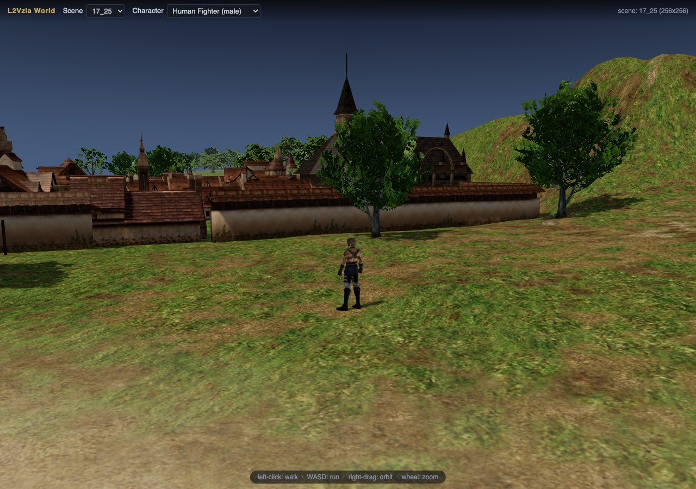 | 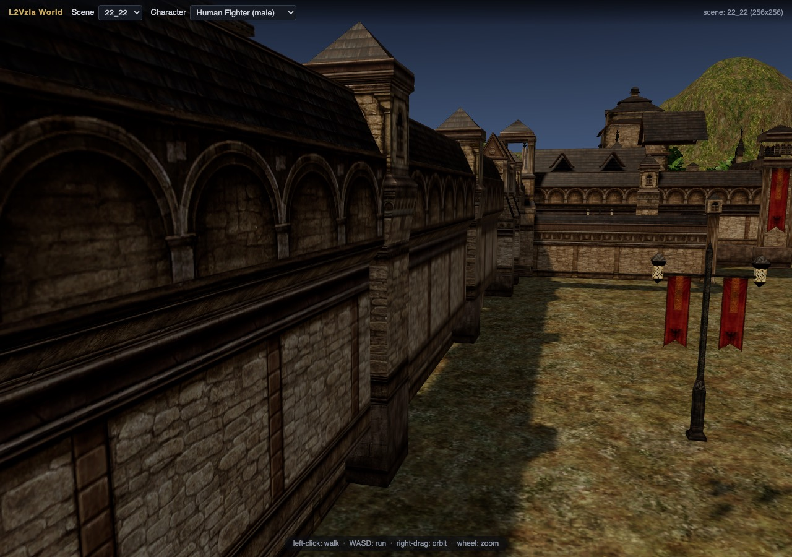 |
| **Talking Island village**, walkable in the browser — converted tile-for-tile from the retail map files | **Giran**, with its architecture — the cathedral facade, city walls, plaza and arcades are BSP brush geometry decoded from the map, not props |
| 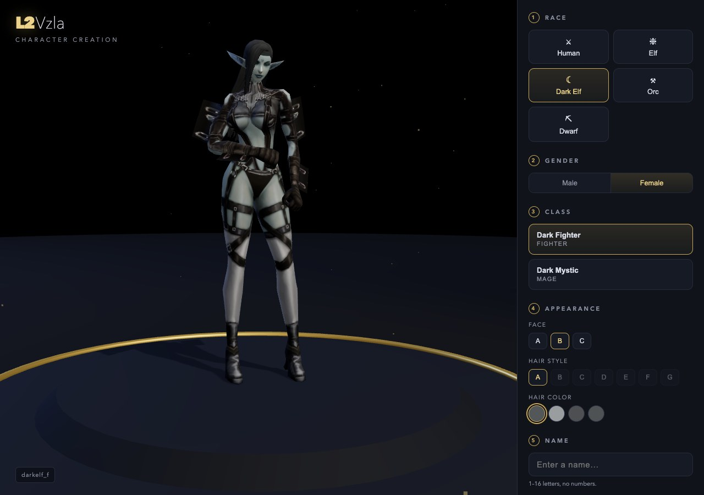 | 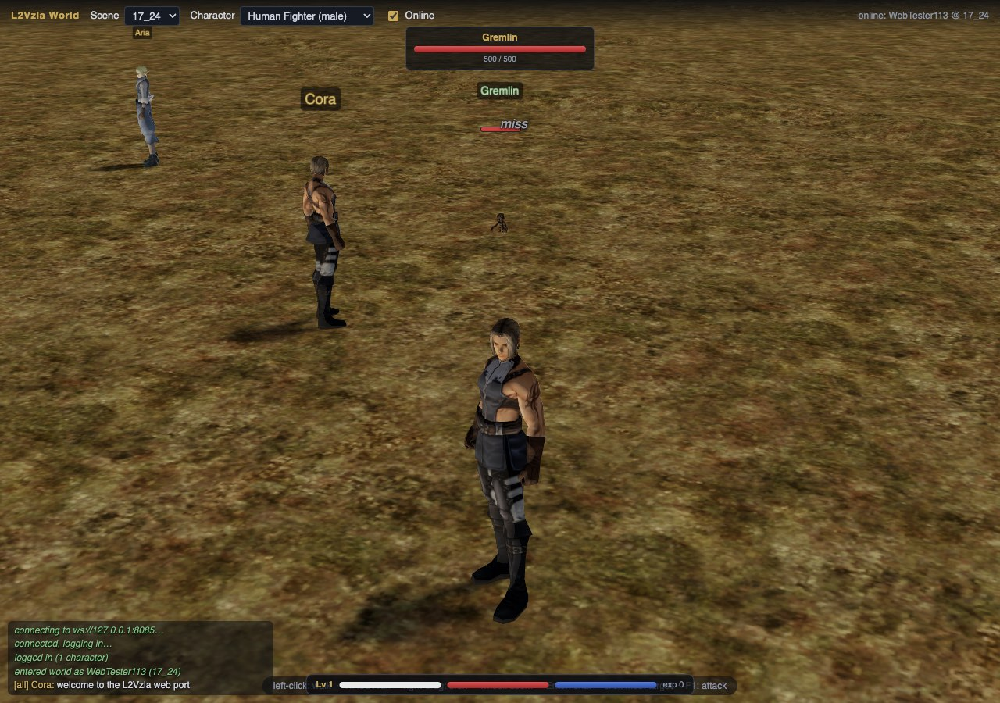 |
| **Character creator** — all 14 race/gender combos rebuilt as glTF, faces and hairstyles from the real game data | **Combat** — target frame, damage floats, HP/MP bars; verified end-to-end against the live server |
| 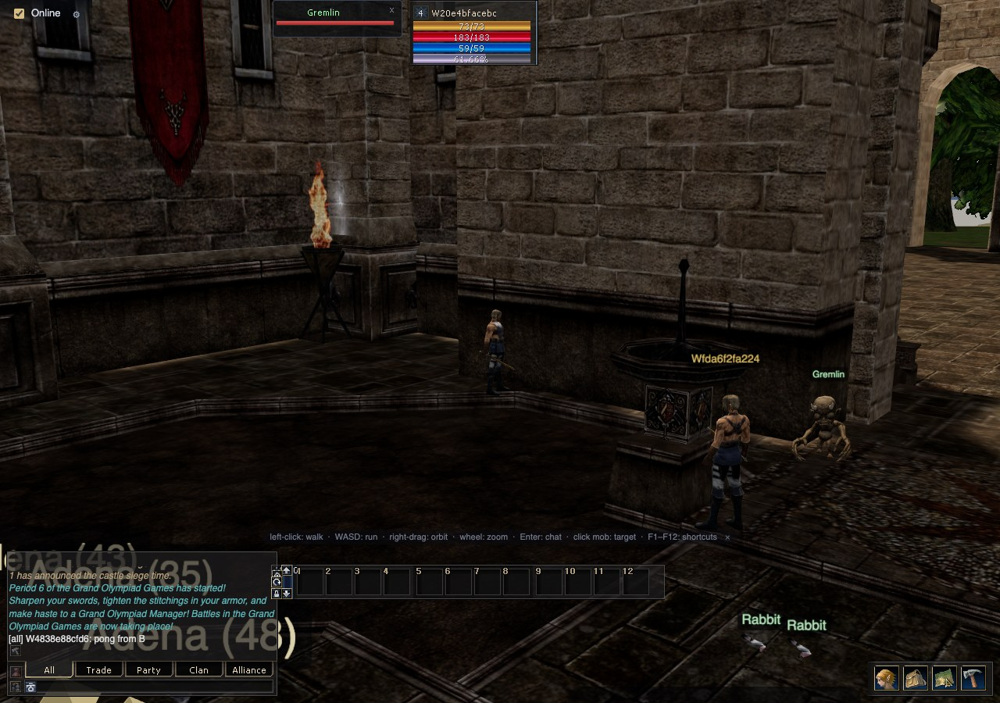 | 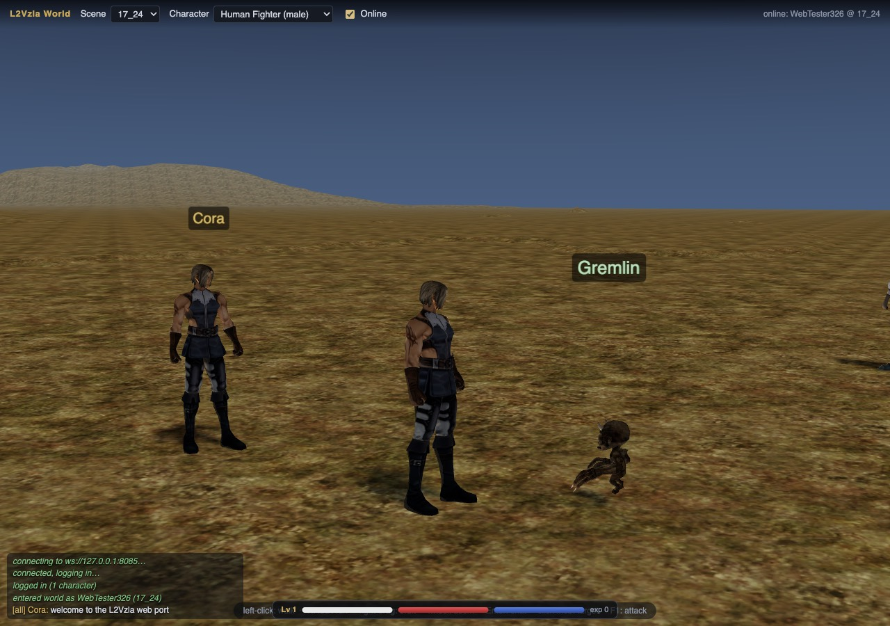 |
| **Multiplayer** — two browsers on the real server, chatting (`ping from A` / `pong from B` in the log) | **Monsters as real models** — a Gremlin with its retail skeleton, textures and animations, not a placeholder |
| 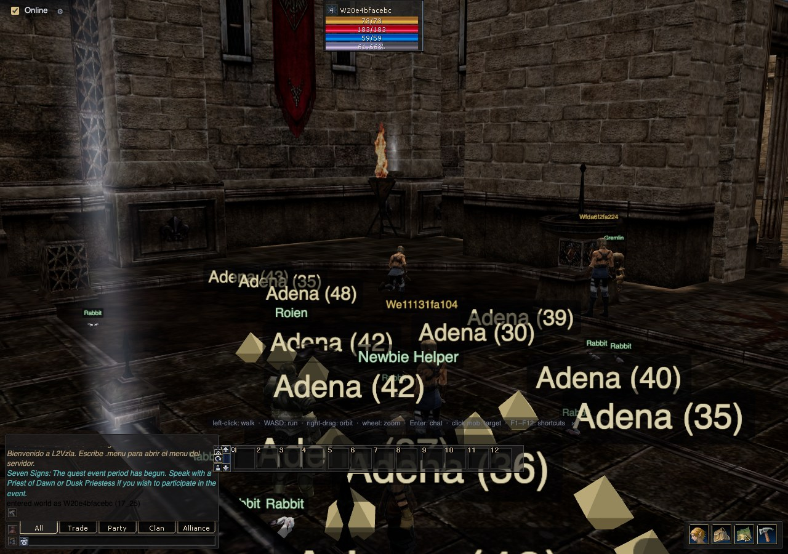 | 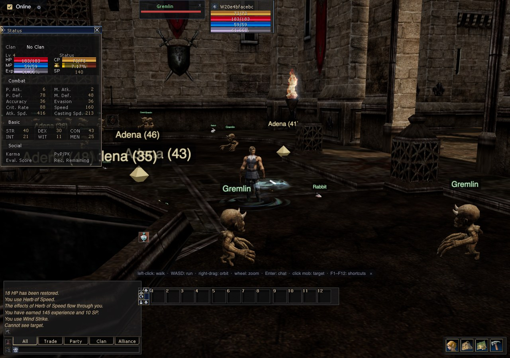 |
| **Towns populated** — Roien, Newbie Helper and 53 more civilians rendered as their real retail models, live from the server | **Character sheet** — live STR/DEX/CON… from the server's own UserInfo, byte-verified against the datapack |
| 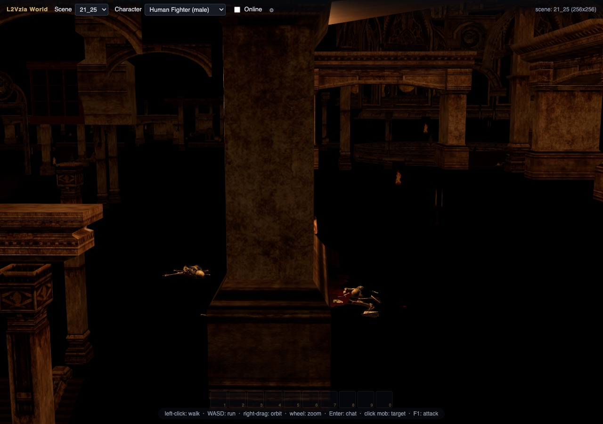 | 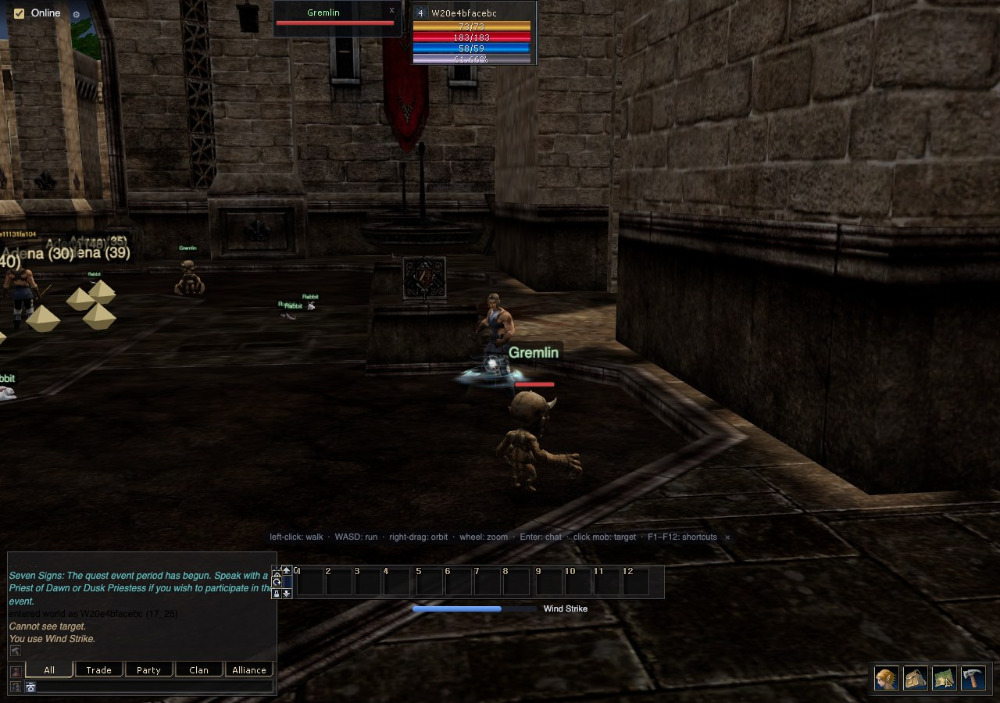 |
| **Dungeon interiors** — the Elven Ruins, now with its architecture: tiled floor, carved columns and the decorated gallery, all BSP geometry decoded from the map | **Skills, hotbar, real game text** — cast skills on cooldown, hotbar with items, and the client's own system messages decoded |
| 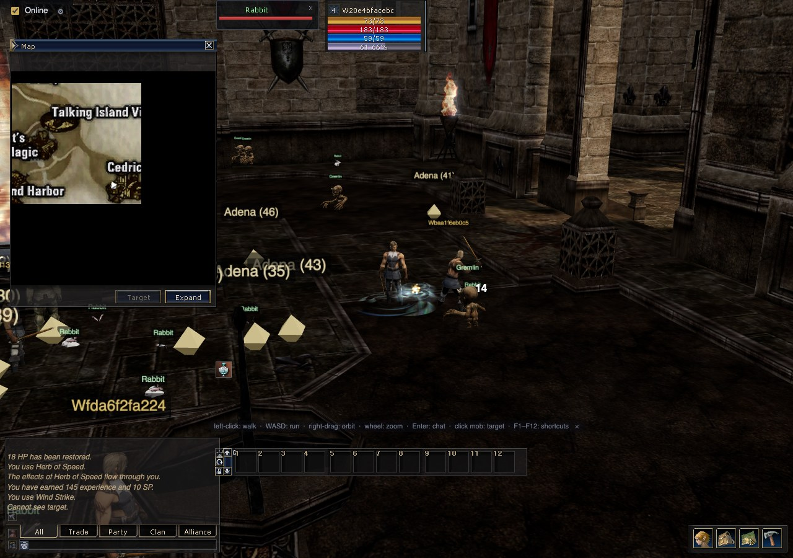 | 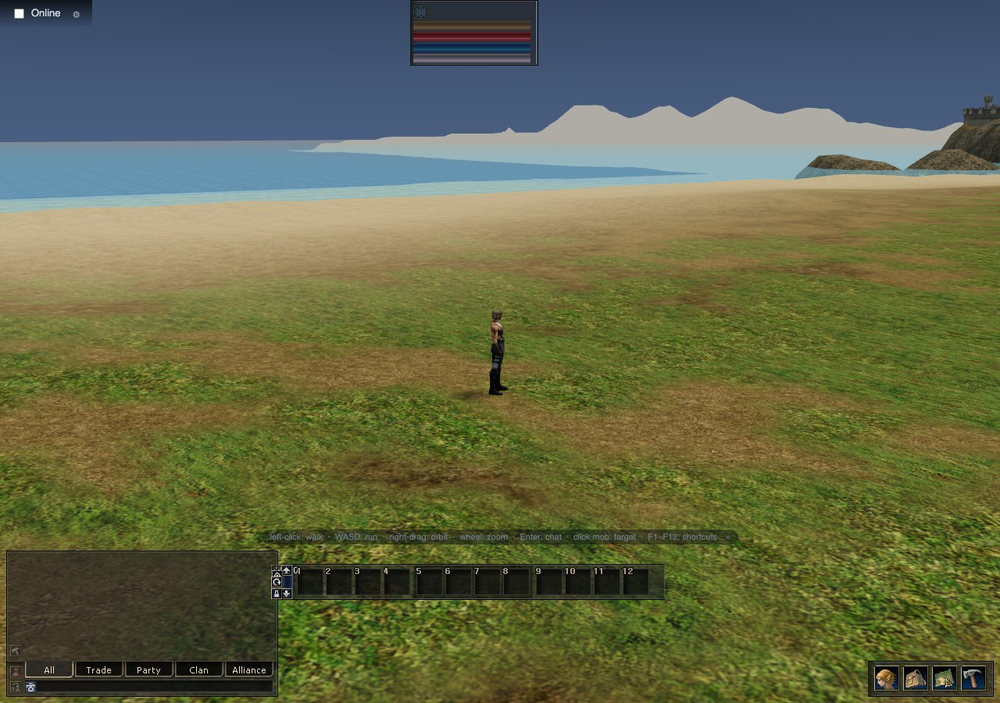 |
| **The retail UI, rebuilt** — 16 windows at geometry mined pixel-for-pixel from the original `Interface.xdat`, chat channels in L2 colors | **Water + splat terrain** — retail water planes and per-layer blend maps composited with the exact UE2 layer rule |

All screenshots are actual output of this repository's own verification
harnesses (headless Chrome driving the real UI).

---

## By the numbers

| Figure | What it is |
|---|---|
| **100** | world map tiles converted to web scenes — every named tile of the Interlude world grid |
| **163,953** | static prop placements extracted from those tiles (buildings, fences, trees…) — every one resolves to a drawable primitive, gated by `prop_census.py --check` |
| **30,177** | textures exported from the client into the PNG library (386 packages) |
| **772** | glTF models built by the pipeline: 14 creation characters + 495 monsters/NPCs + 180 weapons and shields + 83 others |
| **99.7%** | of spawned NPC instances render a real model (54,734 of 54,901) — capsule placeholders down to 2 |
| **332,717** | triangles of BSP building geometry decoded from the maps: shells, interiors, doorways, 100/100 tiles |
| **5,128 + 250** | sound effects unpacked from the 25 encrypted `.uax` banks + music tracks, wired to 9,174 table bindings |
| **172,253** | ambient sound emitters and 383 music zones placed from the retail map actors |
| **1,122 / 1,161** | skill-effect emitters rendered from the decoded particle tables (108 effect meshes, 127 textures) |
| **83** | animation clips per character, one set per weapon stance (Hand/1HS/2HS/Dual/Bow/Pole) — was 14 |
| **29,812** | skill records decoded from the encrypted `.dat` tables (~95k records across 11 files) |
| **2,694 + 9,238** | skills / items with real names + icons for the UI (2,777 icon images extracted) |
| **2,083** | system messages decoded — the client shows the game's own text, not ids |
| **16** | retail UI windows rebuilt at client-exact, mined geometry — zero unjustified pixels (an audit gates the build) |
| **100 / 100** | tiles with the server's own geodata extracted — bridges, indoor floors and real walkable heights |
| **112 / 115** | verification suites passing in the one-command battery (`tools/battery.sh`) — mock 39/39, solo 26/29, gateway 29/29, live 18/18. Every suite is timeout-bounded, so a hang reports as a failure instead of stalling the run. The three open failures each carry a written verdict, not a shrug |
| **41,057 / 60,125** | BSP surfaces carrying their retail **baked lightmaps** (68.3%), decoded to the byte on 99 of 100 tiles — 45,006 records, 907 atlas pages. The rest are `PF_UNLIT`, which retail draws fullbright |
| **148,671,974** | geodata cells that were answering the *wrong* height before the cell-index transpose was fixed — 35.4% of the world, 74% of all non-flat cells |
| **21,589 / 21,589** | world textures at 4x HD — the full pass is complete (`tools/upscale/batch_world.sh` re-runs it idempotently) |
| **157 / 653** | retail `.unr` maps / UE2 packages readable by the toolchain |
| **65** | database tables in the running game server |
| **24 / 24** | format-library tests passing, byte-exact against the reference native tools |
| **12,015 / 12,015** | static-mesh actors carrying a retail footstep bank, each joined to its prop by (mesh, location) — zero unmatched, 98 distinct step sounds |
| **352 / 495** | creatures with a fully bound animation set (idle/walk/run/attack/die), audited clip-by-clip against the retail `.psa` — the rest are documented gaps, not silent fallbacks |
| **8,192** | numeric and colour literals classified by the unsourced-value audit — every one bucketed sourced / authored / unsourced / benign, with a regression gate |
| **3e-8** | max position error of the model converter vs. the reference exporter |

---

## Why this was hard (and how it was solved)

Four war stories. The full details live in `docs/` — each claim there names
the file or command that proves it.

**1. Speaking a 2006 protocol that fights back.**
Browsers cannot open raw TCP sockets, and Lineage 2's protocol is
length-prefixed TCP wrapped in three different cryptosystems. ElberaGate
implements the client half from scratch in JavaScript: RSA with NCSoft's
*scrambled* modulus (unscramble by applying the four scrambling steps in
reverse), a login packet whose XOR obfuscation is **only invertible
backwards** (a forward inverse mathematically does not exist), a
little-endian Blowfish variant ported 1:1 from the server's Java engine and
unit-verified against the real server jar, and a game leg that turns out to
be an XOR stream cipher, not Blowfish at all. Then the traps: the emulator's
`writeF` writes a **double**, not a float — every parser written from retail
documentation desyncs mid-packet. And both servers carry a hardcoded
anti-flood filter that silently bans any IP opening more than 3 connections
per second, refreshing a 300-second ban on every retry — so the gateway
paces all outbound connections through a 400 ms governor. Result: browsers
log in, walk, chat and fight on a real game server that has no idea they are
browsers. (The server carries this project's own mods — offline shops, `.menu`,
and protocol tweaks the gateway depends on; they are exported as a patch in
`deploy/server-mods/`. "Unmodified" would be untrue.)

**2. Format archaeology.**
The client's files are encrypted Unreal Engine 2 packages — some v117, some
v123, each with quirks. The variable-length integer that indexes every
table moves its continuation flag between bit 6 and bit 7 depending on
position; get it wrong and every table desyncs. v123 packages hide an
undocumented Lineage-specific material block between the property stream
and the pixel data — miss it and every texture parse in the game falls
apart (found the hard way, then pinned down byte-for-byte). The terrain
heightmaps are not in the map files at all: they are 16-bit grayscale
*textures* hidden inside the tiles' texture packages, behind a 4-byte
marker. And the `_sp` textures store diffuse color in RGB with a specular
mask in alpha — naive exporters show you the mask, which is why early
renders came out near-black.

**3. NCSoft's own data has bugs — we kept the fixes.**
`Fighter.ukx` contains a duplicated bone name (`Bip01_L_Finger01` where the
second one is really the *right* finger); name-based remapping stretches
glove vertices into a rod between the hands. Twenty-three face meshes are
weighted 100% to the skeleton root, so the head pivots around the pelvis
and any lean opens a visible neck gap. The pipeline fixes both
deterministically (structural bone identity by parent+name; re-anchoring
face vertices to the head bone) — deliberate, documented deviations from
retail, each verified against the ground-truth oracle below.

**4. An oracle, so nothing is guessed.**
How do you prove a converted model is *right*? Build a renderer for the
original data: ElberaView is a rendering-enabled UEViewer build for Apple
Silicon that renders the retail meshes, textures and animations headlessly,
cross-checked against official NCSoft captures. Every visual claim in this
project carries a rendered screenshot inspected by the author; the glTF
emitter is numerically diffed against the reference exporter (positions
match to <3e-8, skin weights exactly); the texture decoders are
cross-validated against the native tool over hundreds of textures
(mean error ≤ 3/255 per channel). Verification is not a phase here — it is
the workflow.

**5. The UI had to be mined, not designed.**
Rebuilding the retail interface raises an awkward question: where does a
window's width come from? Any number a human typed is a guess, so the rule
became *no geometry without a source that outranks judgement*. The sources
had to be excavated first: `Interface.xdat` (encrypted, its own string-table
format — decoder in `tools/xdat/`), the `.gly` layout files, and the
compiled UnrealScript of `Interface.u` (decompiled structure in
`tools/uscript/`). Sixteen windows now render at client-exact mined
geometry, and the rule is enforced mechanically:
`tools/ui/audit_guesses.py --check` scans the UI modules for hand-authored
pixel literals and fails the build on any without a documented source.
Current count: **0 unjustified**.

---

## Architecture

Two planes. The **build plane** runs offline, once: it reads the retail
client and emits web-native assets. The **play plane** is what players
touch: a browser, a protocol gateway, and the real game server.

```
 BUILD PLANE — offline, runs once against your own client
 ──────────────────────────────────────────────────────────────────────────────
  assets/interlude — 157 maps · 653 packages · 40 encrypted .dat
         │
         ▼
 ┌─────────────────────────────────────┐
 │ THE ELBERA TOOLCHAIN                │
 ├─────────────────────────────────────┤
 │ ElberaLib      format library       │
 │ ElberaWorld    .unr → scenes        │──► assets/world/<tile>/scene.json
 │ ElberaBsp      BSP → buildings      │──►   + bsp.gltf     the architecture
 │ ElberaLightmap baked BSP lighting   │──►   + lightmaps    99 tiles, 907 pages
 │ ElberaLight    sun · fog · ambient  │──►   + light.json   the tile's own sun
 │ ElberaSound    .uax → Opus          │──► assets/audio     250 music, 5,128 sfx
 │ ElberaSteps    footstep banks       │──►   + steps.json   12,015 actors, 4 surfaces
 │ ElberaModeler  .ukx → glTF          │──► editor/characters    772 glTF total
 │ ElberaAnim     mesh → animation     │──►   + binding audit vs the retail .psa sets
 │ ElberaArms     weapons · shields    │──►   + weapons/     180 arms and shields
 │ ElberaFx       skill particles      │──► assets/gamedata  skillvfx + skillmesh
 │ ElberaDat      .dat → JSON          │──►   + decoded tables, names, icons
 │ ElberaSkin     xdat → retail UI     │──►   + interface.json   mined geometry
 │ ElberaUpscaler 4x HD textures       │──► assets/world-hd  21,589 textures at 4x
 │ ElberaForge    .utx writer          │──► writes textures BACK into the game
 │ ElberaView     ground truth         │──► renders retail data to compare against
 └─────────────────────────────────────┘
         ▲ ElberaView + official NCSoft captures verify every conversion

 SOURCING GATES — what keeps the port honest
 ──────────────────────────────────────────────────────────────────────────────
  Every tool above carries --check: it re-runs its own verification and exits
  nonzero on regression. Several go further and refuse to emit at all unless
  the output ties back to the client's own data:

   prop_census.py     163,953 placements → every one a drawable primitive
   mine_invslots.py   won't write unless it reproduces every xdat anchor
   audit_guesses.py   gates the UI port: no unjustified pixel ships
   unsourced.py       classifies all 8,192 literals; baseline fails on drift

  This is why a gap here is usually DOCUMENTED rather than quietly filled —
  a plausible guess cannot pass a gate that demands a source.

 PLAY PLANE — what a player touches
 ──────────────────────────────────────────────────────────────────────────────
 ┌──────────────────────────────────────────────┐
 │  BROWSER — no plugin, no download, no login  │
 │  ElberaClient :8083   the game               │
 │  ElberaCreate :8082   character creator      │
 │  three.js + glTF, plain-DOM retail UI        │
 └────────────────────┬─────────────────────────┘
                      │  HTTP: scenes, glTF, Opus, PNG, tables
                      │  WebSocket JSON :8090
                      ▼
             ElberaGate (Node.js) — the L2 protocol codec. Zero game logic.
                      │ TCP :2106 / :7777 · RSA · Blowfish · XOR stream
                      ▼
             aCis rev 409 (Java 21) — the real game server
             MariaDB :3306 · 65 tables · ElberaDeploy brings it up in one command

 ADMIN PLANE: ElberaPanel :8080 (server config) · ElberaAssets :8081 (texture browser)
```

The strategic decision that shapes the project: **the game is not
reimplemented.** aCis runs the world — spawns, combat formulas, skills,
inventory, clans, plus this project's custom mods (offline shops, `.menu`,
autoloot). The gateway is a dumb pipe plus a codec; the server cannot tell
a browser from a retail client.

The second decision, which shapes the *build* plane: **the running server is
an oracle, not just a backend.** Where a value could be read from Java source
or measured from the live server's own reply, the port measures it — fire the
action, intercept the packet, record what actually came back. Attack timing,
movement speed multipliers and walkable heights were all settled that way
rather than by reading code that might not be the code in use. `ElberaView`
(umodel) plays the same role for the client binaries: whatever it renders is
ground truth, and a conversion that disagrees with it is wrong by definition.

---

## The 5-minute tour

Prerequisites: macOS arm64, python3, node, OpenJDK 21, MariaDB — and a
legally obtained Lineage 2 Interlude client extracted to `assets/interlude/`
(game assets are not and cannot be redistributed; see **Legal** below).

```bash
# 1. database + game server (login first, then game)
brew services start mariadb
export JAVA_HOME=/opt/homebrew/opt/openjdk@21 PATH="/opt/homebrew/opt/openjdk@21/bin:$PATH"
(cd server/aCis_gameserver/build/dist/login      && ./startLoginServer.sh &)
(cd server/aCis_gameserver/build/dist/gameserver && ./startGameServer.sh &)

# 2. protocol gateway          → ws://127.0.0.1:8090
(cd gateway && npm install && npm start &)

# 3. the web apps
python3 editor/world/server.py &        # the game client   → :8083
python3 editor/charcreate/server.py &   # character creator → :8082
python3 panel/server.py &               # server config UI  → :8080
python3 editor/server.py &              # texture browser   → :8081

# 4. prove it end-to-end (needs 1–3 running)
(cd gateway && node test/verify-one.js)     # login → enterWorld → NPCs → move → chat: PASS
```

Open **http://127.0.0.1:8083** — click to walk around solo, or tick
**Online**: your account and character are created automatically from a
browser-stored device id. No signup, no login screen.

Zero-Docker alternative for steps 1: `cd deploy && docker compose up -d --build`.

### Play with friends

Share the game over a single https link — no client install on their side:

```bash
deploy/play.sh --tunnel
```

The script brings up the whole local stack (idempotently — whatever is
already listening is skipped), waits for the login and game servers, opens a
Cloudflare quick tunnel to the edge proxy on :8095, and prints a
`https://*.trycloudflare.com` URL: that is the link to send. Anyone with it
lands straight in the game — account and character auto-create on first
login (device-id identity, no password). The link is unguessable but grants
full access, so friends only; keep the Mac awake (`caffeinate`) while they
play, and `deploy/play.sh --stop` closes the tunnel and edge proxy.

---

## The Elbera toolchain

Twenty-three tools, one rule: each does one job, is re-runnable, and carries
its own verification. Pitch first, details after.

| Tool | Pitch | Location |
|---|---|---|
| **ElberaGate** | Browsers play on the real server | `gateway/` (:8090) |
| **ElberaClient** | The game, in a tab | `editor/world/` (:8083) |
| **ElberaCreate** | The character creator, rebuilt | `editor/charcreate/` (:8082) |
| **ElberaEdge** | One public port: client + WS tunnel-ready | `deploy/edge/` (:8095) |
| **ElberaPanel** | Tune the server from a web UI | `panel/` (:8080) |
| **ElberaAssets** | Browse 30k game textures interactively | `editor/` (:8081) |
| **ElberaDeploy** | The whole server in one command | `deploy/` |
| **ElberaLib** | One library that reads every L2 file format | `tools/l2lib/` |
| **ElberaWorld** | Maps become web scenes | `tools/world/` |
| **ElberaModeler** | Retail models become web glTF | `tools/src/char_pipeline/` |
| **ElberaDat** | The encrypted game tables, decoded | `tools/dat/` |
| **ElberaForge** | Write textures *back into* the game | `tools/utx/utxedit.py` |
| **ElberaUpscaler** | 2004 textures, 4x HD | `tools/upscale/` |
| **ElberaView** | The ground-truth oracle | `tools/bin/umodel-view` |
| **ElberaSkin** | The retail UI, mined pixel-for-pixel | `editor/world/js/ui/` + `tools/xdat/` |
| **ElberaSound** | Music and 5,128 effects out of the encrypted banks | `tools/audio/build_audio.py` |
| **ElberaBsp** | The buildings: UE2 BSP → web geometry | `tools/world/bsp.py` |
| **ElberaLight** | Each tile's own sun, ambient and fog | `tools/world/light_extract.py` |
| **ElberaArms** | Weapons and shields as glTF, hung on the retail sockets | `tools/src/char_pipeline/build_weapons.py` |
| **ElberaFx** | Skill particles + effect meshes from the retail tables | `tools/dat/build_skillvfx.py`, `build_skillmesh.py` |
| **ElberaSteps** | Retail footstep banks, per surface and per prop | `tools/audio/build_steps.py` |
| **ElberaAudit** | Every literal in the codebase, sourced or flagged | `tools/audit/unsourced.py` |
| **ElberaLightmap** | Retail's baked BSP lighting, decoded | `tools/world/bsplight.py` |
| **ElberaAnim** | Mesh→animation bindings, checked against the retail sets | `tools/anim/audit_bindings.py` |

Support gear: `tools/battery.sh` — the one-command verification battery
(`--client-only` / `--gateway-only`) · `tools/world/geodata.py` — L2OFF
geodata → per-tile walkable block streams · `tools/world/prop_census.py` —
gates that every one of the 163,953 placements resolves to a drawable
primitive · `tools/upscale/world_manifest.py` — builds the 21,589-texture HD
manifest · `tools/dat/export_skillweapons.py` — skill weapon-gates and target
routing from server data · `tools/ui/audit_guesses.py` — the no-guess audit
that gates the UI port · `tools/ui/mine_invslots.py`,
`mine_shortcutslots.py` — recover control geometry from the shipped UI art
when the xdat decode is thin, and refuse to write unless every xdat anchor is
reproduced · `tools/audio/verify_falloff.py` — the 3D sound falloff constant,
decoded from `ALAudio.dll`.

Every one of these carries a `--check` mode that re-runs its own verification
and exits nonzero on regression. Several are *sourcing gates* rather than
converters: they refuse to emit anything they cannot tie back to the client's
own data, which is why a gap in this port tends to be documented rather than
quietly filled.

### Runtime

- **ElberaGate — the protocol bridge.** One real TCP session per browser:
  the full Interlude login + game handshake (RSA, Blowfish, XOR streams)
  and a compact JSON-over-WebSocket contract — login, move, say, target,
  attack, useSkill, useItem, dialog bypasses, quests, party, shop/trade/
  store ops in; world state, movement, chat channels, combat, skill casts,
  inventory updates, buffs, system messages out. Device-id
  accounts, NPC names resolved from the datapack, 400 ms anti-flood
  governor. Node.js, one dependency (`ws`).
  *Verify:* `cd gateway && node test/verify-one.js` (plus `verify-two`,
  `verify-combat`, `verify-m4`, `verify-m5`, `verify-mods`, `verify-shop`,
  `verify-trade`, `verify-store`, `verify-party`, `verify-quest`,
  `verify-buffs`, `verify-clan`, `verify-create` (browser-driven character
  creation), `verify-respawn` — all PASS against the live server;
  `tools/battery.sh --gateway-only` runs them all).
- **ElberaClient — the walkable world.** three.js world streaming over the
  converted tiles, retail splat-blended terrain, water planes, geodata
  walkable heights, point-click movement with server reconciliation, real
  WASD (streams server-accepted move legs), nameplates, and the full retail
  UI (16 windows) with real icons, skills, quests, shops, trade, private
  stores, party and buffs. Cast/physical-skill/death animations decoded from
  the retail per-race packages (14 clips per character), ground drops with
  nameplates and click-pickup, additive flame rendering, death → respawn in
  town, and system messages rendered with real skill/item names.
  `?hd=1` enables the 4x texture set. Solo offline or online through
  ElberaGate.
  *Verify:* `cd editor/world && node verify_live.js` (two headless browsers
  on the real stack); `tools/battery.sh --client-only` runs the 24 UI/world
  suites.
- **ElberaCreate — the character creator.** All 14 race/gender combos from
  the frozen glTF manifest, faces/hair/colors from the real chargrp/hairgrp
  tables, HD-upscaled textures. Creates REAL characters on the live server:
  embedded at `/create/` in ElberaClient on accounts with no character
  (`createChar` gateway op, race/sex/class/face/hair/name → real aCis
  CharCreate). *Verify:* `cd editor/charcreate && node verify_app.js`;
  end-to-end `cd editor/world && node verify_charcreate.js` (mock) and
  `cd gateway && node test/verify-create.js` (live).
- **ElberaEdge — the public edge.** Single-port reverse proxy
  (`deploy/edge/`, :8095): HTTP to ElberaClient + WebSocket `/ws` to
  ElberaGate, so one Cloudflare tunnel URL serves the whole game — the
  client defaults its gateway to same-origin `/ws` when not on localhost.
  *Verify:* `cd deploy/edge && npm test` (proxy self-test) and
  `node test/verify-public.js https://<tunnel-url>` (live login →
  enterWorld through the tunnel).
- **ElberaPanel — server config UI.** All 493 catalogued aCis config keys
  with ES/EN labels, stock-default comparison, timestamped backups,
  source→dist sync. Dependency-free Python.
  *Verify:* `curl -s http://127.0.0.1:8080/api/status`.
- **ElberaAssets — texture browser.** Interactive `.utx` explorer with
  cached thumbnails and a replace hook wired to ElberaForge.
  *Verify:* `curl -s http://127.0.0.1:8081/api/config`.
- **ElberaDeploy — one-command stack.** docker compose: MariaDB 11.4
  (schema auto-installed, 65 tables), loginserver + gameserver on Temurin
  21, per-environment config patching, `EXTERNAL_HOSTNAME` for production.
  *Verify:* `nc -z 127.0.0.1 2106 && nc -z 127.0.0.1 7777` (arm64 verified
  2026-07-23; amd64 untested).

### Build plane

- **ElberaLib — the format library.** Pure-stdlib Python for every
  reverse-engineered format: UE2 packages (v117/v123), Lineage2Ver
  encryption (protocols 111–414), FCompactIndex, both property-tag
  variants, the hidden L2 material block, pixel decoders (DXT1/3/5, RGBA8,
  RGB8, L8, P8, G16), Shader→diffuse resolution, `.dat` containers.
  *Verify:* `python3 tools/l2lib/tests/run_tests.py` — 24/24, byte-exact
  against the native tools.
- **ElberaWorld — the map converter.** `.unr` tile → self-contained web
  scene: G16 heightmap, layer + splat tables, water planes, all prop
  placements, `.usx` props as glTF, and per-tile walkable geodata decoded
  from the server's own L2OFF regions (`geodata.py`, 100/100 tiles).
  100/100 named tiles pass validation.
  *Verify:* `python3 tools/world/convert.py --check 17_25`; client-side
  `node verify_geodata.js`.
- **ElberaModeler — the model pipeline.** `.ukx` → glTF 2.0 with a
  zero-remap full-skeleton merge (absorbs NCSoft's duplicated bone names),
  per-part skins, head re-anchored face shells, hair caps that close the
  skulls, chargrp-authoritative texturing.
  *Verify:* `/usr/bin/python3 tools/src/char_pipeline/validate_gltf.py editor/characters/models/*.gltf`.
- **ElberaDat — the table decoders.** 11 RSA-encrypted game-data files →
  JSON (~95k records: npcs, items, skills, names, UI strings, system
  messages), every parser asserting exact byte consumption. Plus
  `build_meta.py`, which joins the tables into the UI metadata layer
  (skill/item names + icons).
  *Verify:* `tools/bin/l2encdec -c decode -p 413 -o /tmp/chargrp.dec assets/interlude/system/chargrp.dat && (cd tools/dat && python3 parse_chargrp.py /tmp/chargrp.dec | head)`.
- **ElberaForge — the texture writer.** Swaps a texture inside an
  encrypted `.utx` in place: regenerates every mip, re-encodes in pure
  Python (DXT1/DXT5/RGBA8/RGB8/L8), patches only mip payloads, re-encrypts.
  Round-trips pixel-exact through the reference tools — previously
  Windows-only territory.
  *Verify:* `python3 tools/utx/utxedit.py list tools/samples/t_aden.utx`.
- **ElberaUpscaler — the HD pipeline.** Vendored Real-ESRGAN
  (`realesrgan-x4plus`): all 92 character textures at 4x, alpha preserved
  and halo-checked, plus the world-texture pilot (tiles 17_25 + 22_22,
  all 21,589 textures side-by-side in `assets/world-hd/`, LQ untouched as the
  fallback). The full 21,589-texture world pass is driven by
  `world_manifest.py`.
  *Verify:* `sips -g pixelWidth <out.png>` — exactly 4x the source;
  `WORLD_BASE='http://127.0.0.1:8083/?hd=1' node verify_terrain.js hd`.
- **ElberaView — the ground-truth oracle.** Rendering-enabled UEViewer for
  Apple Silicon: renders the actual retail meshes/animations headlessly to
  PNG via env-var controls, cross-checked against official NCSoft captures.
  *Verify:* renders land in `./Screenshots/` (see `docs/ground-truth.md`).
- **ElberaSkin — the retail UI port.** The client's own interface,
  excavated and rebuilt: `tools/xdat/parse_xdat.py` decodes the encrypted
  `Interface.xdat` string tables, `tools/uscript/` mines the compiled
  UnrealScript layout code, and the window modules in
  `editor/world/js/ui/` render 16 windows at the mined geometry. The
  no-guess rule is mechanical: `tools/ui/audit_guesses.py --check` fails on
  any unjustified pixel literal (currently 0).
  *Verify:* `python3 tools/ui/audit_guesses.py --check`;
  `node verify_ui.js` + per-window suites.

The native foundation binaries (`tools/bin/umodel`, `tools/bin/l2encdec`)
are Apple-Silicon ports of UEViewer and open-l2encdec — third-party code we
patched and vendored (`tools/build-tools.sh`); everything layered on top is
ours.

---

## What works today — verified

- **The world has buildings.** Every shell and interior in this game is BSP
  brush geometry, and it is now decoded: the post-CSG level UModel whose points
  are already world coordinates, 118,310 node polygons drawn as 332,717
  triangles over 100/100 tiles. Giran has its cathedral facade, walls, plaza
  and arcades; the Elven Ruins has floors, walls and a ceiling instead of
  columns over void. All 18,861 `Polys` exports across all 157 maps consume
  their serial size exactly, and every surface's material agrees 100% with the
  same material resolved through the independent brush parser
  (`tools/world/bsp.py --check`, `verify_bsp`).
- **The game has sound.** 250 music tracks (a 4-byte splice: NCSoft only
  overwrote the "OggS" page marker) and 5,128 effects out of the 25 encrypted
  `.uax` banks, mono for the Web Audio panner. Combat impacts, creature cries,
  weapon swings, spell casts and interface clicks all come from the tables that
  name them — 1,087 of the game's own 1,093 sound references resolve, and the
  six that do not are malformed in NCSoft's data. The map's own soundscape is
  placed too: 172,253 ambient emitters and 383 music zones
  (`tools/audio/build_audio.py --check`, `verify_audio`).
- **Combat runs on the server's clock.** Attack cadence from `pAtkSpd` through
  aCis's own `Formulas.calculateTimeBetweenAttacks`, the animation rate from
  the `attackSpeedMultiplier` the server sends for exactly this purpose, damage
  floats at the real hit delay (`timeAtk/2` melee, `timeAtk` bow, split for a
  dual wield), and cast gestures stretched to `MagicSkillUse.hitTime`. Verified
  arithmetically against 6,499 datapack templates and empirically: a predicted
  1201 ms swing cycle against observed gaps of 1188/1206/1208/1193
  (`verify-atkspeed` 12/12, `verify_atktiming` 13/13).
- **Gear renders, in the right stance.** Gear hangs on the bones the retail
  pawn classes name for it, at an identity transform — 410 of 417 meshes ship
  an identity MeshScale, so no offset was ever needed. Which bone is decoded,
  not chosen: `LineageWarrior.u`'s class defaults set `RightHandBone =
  Weapon_R_Bone`, `LeftHandBone = Weapon_L_Bone` and `LeftArmBone =
  Shield_L_Bone` identically on all 14 playable pawn classes, so a **shield
  goes on the arm bone, not the hand bone** — it used to go on `Weapon_L_Bone`
  and stuck out of the fist edge-on (`verify_shield` 11/11). Holding a sword
  selects the retail 1HS animation set: 83 clips per character across six
  weapon stances, where the pipeline used to extract 14 and stand every
  character unarmed (`verify_equipment` 14/14).
- **99.7% of spawned NPCs are real models.** 495 monster and NPC models, up
  from 150; colour-coded capsule placeholders are down from 15,558 spawned
  instances to 2. Their animation bindings are decoded from the `.ukx` rather
  than matched by name, which corrected 42 creatures — some had been animated
  as an entirely different animal (`coverage.py --check`).
- **Skill effects come from the particle tables.** 1,122 of 1,161 emitters on
  the bound effect classes, including all 413 mesh emitters, with 108 effect
  meshes and the retail colour ramps, size curves and spin axes. Skills with no
  sourced effect draw nothing rather than an invented colour
  (`build_skillvfx.py --check`, `verify_skillvfx`).
- **The world is lit the way the map says.** Sun direction, ambient and fog
  from each tile's own `NMovableSunLight` and `ZoneInfo` — two distinct sun
  setups across the 100 tiles, so no single constant could have been right.
  Fog falls back to `Engine.ZoneInfo`'s decoded class defaults, confirmed by
  the fact that no map serialises them (`light_extract.py --check`).

- **Playable beta loop.** Browser character creation (real race/class/
  appearance/name on the live server) and a character-select screen for
  multi-char accounts, click-to-move with A* pathfinding over the server's
  own geodata (walls and cliffs routed around, bridges and underpasses
  resolved by the retail walk rule) plus real WASD, melee and skill combat
  with cast/physical/death animations decoded from the retail packages,
  the aCis tutorial delivered in-browser (welcome pages, TE links,
  question marks), ground drops with nameplates and click-pickup, death →
  respawn in town, system messages with real skill/item names, and
  characters at true L2 scale (nativeHeight decoded per model from the
  retail `.ukx` MeshScale, cross-checked against the server's own
  collision heights) — all live-verified (`verify-create`,
  `verify-respawn`, `verify-tutorial`, `verify_charcreate`,
  `verify_charsel`, `verify_pathfinding`, combat suites).
- **Real protocol gateway.** Live sessions on the real server: NPCs,
  players, movement, chat, combat, skills, inventory, quests, party, buffs,
  shops, trade, private stores, clans — `gateway/test/verify-*.js` all PASS.
- **The full core loop in the browser.** Talk to an NPC through the retail
  dialog window (bypass links work — the server's `.menu` mod round-trips
  live), take a quest and track it in the quest journal (Alt+U), buy and
  sell at real merchants, trade player-to-player, open a private store —
  including the custom **offline-store mod** (the shop keeps selling after
  you disconnect), party up, and watch buffs tick in the abnormal-status
  strip (`verify-dialog`, `verify-shop`, `verify-trade`, `verify-store`,
  `verify-party`, `verify-quest`, `verify-buffs`, `verify-mods` — live).
- **The retail UI, pixel-faithful.** 16 windows — status, target, shortcut,
  skills, inventory, chat, system menu, NPC dialog, actions, minimap, quest,
  party, buffs, shop, trade, private store — at geometry mined from
  `Interface.xdat` / `Interface.u`, with the no-guess audit at 0
  unjustified literals (`verify_ui` + per-window suites).
- **Live two-player combat.** Two browsers see each other, walk, chat;
  target and kill a Gremlin; a third client watches the fight; exp arrives
  (`verify-two` / `verify-combat` / `verify-observer` / `editor/world/verify_live.js`).
- **Skills & items end-to-end.** A scripted client casts a self-buff, nukes
  a Gremlin to death with Wind Strike, and loots the adena — while the
  browser shows the casting bar, skill cooldowns and inventory updates with
  the real icons. Weapon requirements gate the skill cells (Power Strike
  refuses a dagger), mined from the server's own data because the client
  tables provably don't carry them (`verify-m4`, `verify_skills`,
  `verify_skilldepth`).
- **Terrain the way retail drew it.** Per-layer splat maps blended in the
  client shader with the exact UE2 layer rule, water planes from the map
  data, walkable heights from the server's own geodata (bridges and indoor
  floors work — 100/100 tiles), and dungeon tiles rendered as torch-lit
  interiors with prop-based fire lights (`verify_terrain`, `verify_geodata`,
  `verify_interior`).
- **HD mode.** `?hd=1` swaps the two pilot towns to 4x-upscaled textures
  (21,589 textures; splat maps byte-identical in both modes). The full
  21,589-texture pass is staged (`tools/upscale/world_manifest.py`).
- **Towns that look like towns.** 55 civilian NPCs (Roien, Newbie Helper,
  merchants, priests, guards…) rendered as their real retail models at true
  scale, mapped from the live spawn data (`verify_civilians`, `verify_live`).
- **Full chat & character UI.** Whisper/shout/trade channels with L2
  colors, character sheet with live server stats, persistent hotbar, retail
  minimap with verified georeference, and 2,083 decoded system messages
  rendered as real text (`verify-m5`, `verify_m5`, `verify_minimap`).
- **The whole world converted.** 100 tiles, 163,953 prop placements, every
  `scene.json` passing validation; tile↔region naming cross-validated
  against five independent sources ([docs/tile-map.md](docs/tile-map.md)).
- **97 production models**, structurally validated, numerically diffed
  against the reference exporter, visually inspected against the oracle.
- **The texture repack gap closed** — ElberaForge writes encrypted `.utx`
  packages the game reads back pixel-exact.
- **A tuned game server** with custom Java mods (offline shops, `.menu`,
  `.autoloot`, `.expon/.expoff` — play-tested 8/8 through the real protocol)
  and 139 geodata regions installed.

## Honest limitations

- **The browser is a renderer, not the game.** All logic lives in aCis; the
  client implements the protocol subset in the gateway contract. Not
  bridged yet: craft/recipes. (Multisell and warehouse ARE bridged and
  live-verified — `verify-multisell`, `verify-warehouse`.) The **clan window is deliberately shelved** — the pledge
  protocol itself is done and live-verified (creation through the real
  VillageMaster dialog chain, invite/accept, leave, oust, crest) but the
  client UI was cut by product decision. Private *buy*-store ops are
  contract-complete and source-verified; the sell-store flow is the one
  verified live end-to-end.
- **Identity by possession.** Your account is a device id in
  `localStorage` — clearing browser data loses the character (the settings
  panel shows the id as a recovery code you can save). The gateway is
  plaintext localhost WebSocket, not hardened for public exposure.
- **Terrain texturing follows the retail splat maps** (per-layer alphamaps
  blended in the client shader with the exact UE2 layer rule — base layer +
  `mix` per splat weight, diffuse tiling 128 L2 units, verified against
  retail registration; `editor/world/verify_terrain.js`). Residual gaps:
  per-layer `UScale`/`VScale` are deliberately absent from the frozen
  scene.json contract (~20% of layers tile at the default density), and
  particles and baked lighting are not extracted (dungeons get prop-based
  torch lights instead).
- **BSP brush buildings are extracted** (2026-08-07): the post-CSG level
  UModel of every tile decodes to a sibling `assets/world/<tile>/bsp.gltf`
  — 118,310 of 146,740 node polygons over the 100 converted tiles, textured
  and world-placed, rendered by `editor/world/js/bsp.js`. Contract and the
  drop rules: `tools/world/README.md` ("bsp.gltf contract"); format:
  `docs/map-format.md` §3.3. Lightmaps are still not decoded, and the
  terrain mesh currently buries the BSP town-square slab by ~32 units on
  Giran — measured and documented, not papered over (same README section).
- **Skill effects: 39 of 1,161 emitters are not reproduced.** 13 VertMesh and
  11 Beam emitters, plus 10 whose texture was never staged and 5 whose
  `StaticMesh` is unset in the retail data. The `.3d` VertMesh export works but
  nothing decodes it yet; beam tessellation is native code. Counted, not
  approximated — and a skill with no sourced effect draws nothing rather than
  an invented colour.
- **One sound constant is calibrated, not decoded.** `RADIUS_UNIT` in
  `editor/world/js/audio.js` converts the tables' sound radii to metres. The
  radii demonstrably are not world units (a skill's 40 would be 0.4 m), but
  `Engine.u` declares `SoundRadius` as a bare `float` with no unit, so the
  stock-Unreal quantisation rule does not apply. The current value puts all
  three independent tables in plausible ranges at once — corroboration, not a
  derivation. It is the only number in the client knowingly in that state, and
  it says so in the file.
- **NPC titles are carried but not drawn.** 2,259 NPCs have a retail title
  ("Raid Boss", "Ol Mahum Lord") and it reaches the client, but the nameplate
  renders one line. Retail puts the title on its own line; the ordering could
  not be sourced from the decoded data, so it is left undone rather than
  guessed. Nameplate *colour* is sourced and live — the 537 raid bosses render
  in their own blue.
- **Two NPCs and one prop cannot be built from the data.**
  `heart_of_warding` (2 spawned instances) is textured with a `TexEnvMap` over
  a cubemap with no diffuse bitmap; 165 instances have an empty `mesh_name` in
  `npcgrp`. Painting them with anything else would invent their appearance.
- **1,866 literals in the codebase are still unsourced** (down from 2,228; the
  UI and audio lanes are at zero). A repo-wide audit
  (`tools/audit/unsourced.py --check`) classifies all 8,192 numeric and colour
  literals as sourced / authored / unsourced / benign, with a baseline that
  fails on regression. 751 of the unsourced are in the client, and the ranked
  worklist with true values recovered where they exist is in
  [editor/world/audit_report/unsourced.md](editor/world/audit_report/unsourced.md).
  Publishing the number is the point: this port's rule is that a documented
  gap beats a plausible guess, and an unmeasured codebase cannot honour it.
- **HD is expensive.** 4x textures weigh ~24x the LQ set (pilot tiles went
  76 MB → 1.86 GB) and HD is off by default for that reason; the full
  21,589-texture pass is complete.
- **Headless verification renders on SwiftShader** (software GL), which is
  slow on NPC-dense scenes — the suites wait on conditions, not clocks.
  Real GPUs run the client fine.
- **`all` chat is radius-limited to 1,250 units by the server itself** —
  use shout (channel 1) for reach.
- **Deploy**: arm64 verified, amd64 untested; retail-client login through
  Docker untested.

## Roadmap

Milestones M1–M5 of the [master plan](docs/web-port-architecture.md) are
done — walkable world, multiplayer, combat, skills, items, chat, the retail
UI, quests, shops, trade, private stores, party and buffs all run live
against the real server.

- **Next.** Craft/recipes — the last unbridged core system. (The HD pass,
  multisell and warehouse are done; BSP building geometry and the retail
  light rig landed 2026-08-08.)
- **Shelved, ready to resume.** Clan window — protocol done and
  live-verified; only the client UI is missing.
- **After that.** Seven Signs catacomb tiles (16_12/18_10/19_10/20_10),
  KTX2 textures, WebGPU evaluation, mobile layout, public VPS deployment
  ([runbook](docs/README-ADMIN.md), ES).

---

## Repository map

```
assets/interlude/    your client data (gitignored — never committed)
assets/gamedata/     decoded .dat tables + UI metadata as JSON (tracked; icons gitignored)
assets/world/        100 converted tiles + tile-map.json (gitignored, regenerable)
server/              aCis rev 409 — separate third-party repo, own license
gateway/             ElberaGate (:8090)          panel/   ElberaPanel (:8080)
editor/              ElberaAssets (:8081) · charcreate/ (:8082) · world/ (:8083)
tools/               the build-plane toolchain   deploy/  ElberaDeploy
docs/                15+ deep dives — start with HANDOFF.md
docs/img/            the screenshots above
```

**Documentation:** [docs/HANDOFF.md](docs/HANDOFF.md) — continue the project
from zero context · [docs/web-port-architecture.md](docs/web-port-architecture.md)
— master plan + milestones · [gateway/README.md](gateway/README.md) — protocol
contract + crypto gotchas · deep dives:
[character pipeline](docs/character-pipeline.md) ·
[monsters](docs/monster-pipeline.md) ·
[weapons](docs/weapon-pipeline.md) ·
[map format](docs/map-format.md) · [tile map](docs/tile-map.md) ·
[ground truth](docs/ground-truth.md) · [assets tooling](docs/assets-tooling.md) ·
[dat formats](docs/dat-format-notes.md) · per-tool READMEs under `tools/`.

## Legal

- **Elbera's code** (tools, gateway, web apps, deploy, docs) is released
  under the **MIT License** — see [LICENSE](LICENSE).
- **Lineage 2 game assets are not included and are not redistributable.**
  Textures, models, maps, audio and `.dat` tables are © NCSoft Corporation.
  You need a legally obtained Lineage 2 Interlude client; Elbera's tools
  extract and convert assets from your own copy at build time. The bulk
  outputs — converted tiles, textures, models, audio, icons — are gitignored
  and regenerable (see `.gitignore`). The decoded `.dat` tables under
  `assets/gamedata/*.json` are the exception: they are tracked, so the
  toolchain's output can be inspected without owning a client. They are
  NCSoft's data in a different container, and regenerable from your own copy
  with `tools/dat/`.
- **The server emulator is a separate project.** `server/` is a third-party
  aCis rev 409 mirror (L2J lineage) with its own history and license — see
  `server/LICENSE`. Elbera's MIT license does not cover it.
- Vendored third-party components keep their own licenses: UEViewer
  (© Gildor), open-l2encdec (MIT), Real-ESRGAN (BSD-3-Clause), SDL2 (zlib),
  sse2neon (MIT), three.js (MIT), ws (MIT).
- Elbera is a non-commercial fan/research project, not affiliated with or
  endorsed by NCSoft.

---

## Resumen en español

**Elbera** lleva Lineage 2 Interlude al navegador sin reescribir el juego:
abres una URL y juegas el ciclo completo — NPCs, otros jugadores, combate,
habilidades, quests, tiendas, comercio entre jugadores, tiendas privadas
(incluida la tienda offline del servidor), party y buffs — servido por un
servidor L2 de verdad que no nota la diferencia entre tu navegador y el
cliente original.

¿Cómo? El servidor aCis sigue corriendo el juego completo (combate,
inventario, clanes, mods propios como tiendas offline y `.menu`), y
**ElberaGate**, un puente WebSocket, habla el protocolo real de red
(RSA, Blowfish y el cifrado XOR del juego, implementados en JavaScript y
verificados contra el servidor en vivo). Todo el contenido —100 mapas del
mundo con su geodata caminable, 97 modelos 3D con sus animaciones, más de
30 mil texturas— se extrae del cliente original con nuestra propia cadena de herramientas:
librería de formatos (ElberaLib), conversor de mapas (ElberaWorld),
pipeline de modelos (ElberaModeler), decodificadores de tablas (ElberaDat),
escritor de texturas `.utx` (ElberaForge), escalado HD con IA
(ElberaUpscaler) y un "oráculo" que renderiza los datos originales para
verificar que cada conversión es correcta, captura por captura.

Ya funciona: la interfaz retail reconstruida al píxel (16 ventanas con
geometría minada del `Interface.xdat` original, con una auditoría
automática que prohíbe números inventados), diálogos de NPC con el `.menu`
del servidor funcionando en vivo, quests con su diario (Alt+U),
compra/venta en mercaderes reales, trade entre jugadores, tiendas privadas
con vendedor offline, party, buffs con sus iconos, minimapa con el mapa
retail, terreno con blending de splats como el cliente de 2006, agua,
puentes caminables gracias a la geodata, mazmorras iluminadas con
antorchas y modo HD 4x (`?hd=1`, completo en las dos ciudades piloto; el
pase completo de 21.589 texturas está preparado). Los mods del servidor
(`.menu`, `.autoloot`, `.expon/.expoff`, tiendas offline) están verificados
en juego, por protocolo. Lo que falta: multisell, almacén (warehouse),
crafteo, la ventana de clan (el protocolo ya está hecho y verificado; la
UI quedó en pausa por decisión de producto), las catacumbas de Seven Signs
y la apertura pública en un VPS. Ojo: tu cuenta vive en el navegador —
guarda tu código de recuperación (panel de ajustes).

Los assets del juego **no** se incluyen ni se redistribuyen: necesitas un
cliente Interlude obtenido legalmente. Nuestro código es MIT.

Para continuar el proyecto desde cero: **[docs/HANDOFF.md](docs/HANDOFF.md)**.
