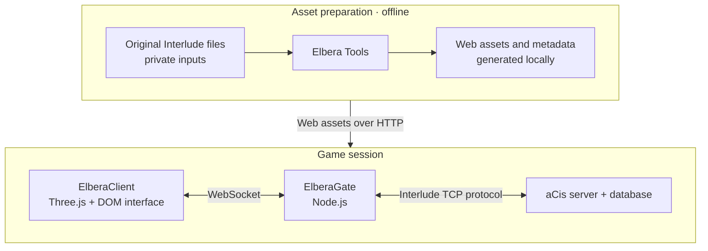

<div align="center">

# E L B E R A

### Lineage II Interlude. In your browser.

**Porting the original game-client experience to the web.**<br>
A browser client, an Interlude protocol gateway, and Elbera Tools for the L2 community.

[](https://github.com/elberacasa/Lineage2Elbera/actions/workflows/source-checks.yml)
[](https://github.com/elberacasa/Lineage2Elbera/releases/tag/elbera-tools-core-v0.1.0)
[](LICENSE)

[The game](#the-game) · [Elbera Tools](#elbera-tools) · [Recent progress](#recent-progress) · [Get started](#get-started) · [Roadmap](#roadmap) · [Español](#en-español)

</div>


<p align="center"><em>From the project's development gallery: Giran, equipped armor and shield, and the browser interface in one frame.</em><br>
<a href="docs/SHOWCASE.md">Explore the game gallery</a> · <a href="docs/img/README.md">Capture history and context</a></p>

## The game

ELBERA brings Lineage II Interlude to the web: its world, characters, skills,
animations, effects, progression and interface, with no installed game client
for players. This repository, developed locally as `l2vzla`, contains the
browser client and the tools being built to make that possible.

The browser already connects through **ElberaGate** to an aCis server for
movement, combat, inventory, NPC interaction and other gameplay systems.
Recent checks include a completed quest with its reward preserved after
reconnect, an actual merchant purchase, and original appearance and UI data
recovered from the client.

**Status: active development.** The next delivery is a small invited playtest;
the goal remains the full Interlude client. World fidelity, animation, effects,
interface details and whole gameplay systems still need work. The
[coverage inventory](docs/PORT-COVERAGE.md) records what is implemented,
source-verified and tested through normal play.

| Talking Island | Giran |
| --- | --- |
|  |  |
| Coastal terrain, water and map geometry. | Town architecture, stonework and public spaces. |

*These retained game captures show earlier development builds. New tool captures
appear below; current feature status is recorded in the coverage inventory.
The [full gallery](docs/SHOWCASE.md) also preserves character creation, combat,
multiplayer, NPCs, dungeons and interface views.*

## Recent progress

**September 2026** — work now follows original inputs through decoding,
browser behavior and focused verification.

| Area | What advanced | Follow the work |
| --- | --- | --- |
| **Character appearance** | Original face indices, five male / seven female creation hairstyles, four source color choices, and corrected default hair mesh/material selection. | [Appearance](docs/native-face-selection-evidence.md) · [Hair pipeline](docs/hair-asset-pipeline.md) |
| **Hair and material inspection** | All **162** base-table meshes exported with original LOD0 geometry and weights; **648** material references retain their source identities. The inspector shows rigid and soft-rig parts in a static view. | [Inspecting original hair](docs/hair-asset-pipeline.md#browser-inspection) |
| **Native transform research** | Ordinary and dynamic hair paths distinguished; retained coordinate arithmetic checked. A separately pinned comparison copy identifies missing imports within exactly matched code blocks. | [Attachment evidence](docs/native-hair-attachment-evidence.md) · [Comparison scope](docs/supplemental-engine-evidence.md) |
| **Original animation keys** | All **1,367** player sequences decoded without resampling. The pawn inspector now compares original sparse-key poses using recovered interpolation against the existing export; full native skeletal playback remains open. | [Preview and evidence](docs/native-track-evidence.md#browser-pose-preview) |
| **Quest progression** | *Letters of Love* completed through server interactions; the reward survived reconnect and appeared in the browser inventory. | [Quest playtest](docs/quest-completion-playtest.md) |
| **Shops and original dialogs** | A browser purchase and potion use changed server-owned inventory and currency. Quantity and confirmation dialogs use recovered client rules. | [Shop playtest](docs/shop-playtest.md) |
| **Recipes and shortcuts** | Recipe books, manufacture details and source-index shortcuts are connected; the live empty Common Craft book was checked. Successful crafting remains a separate test. | [Recipe evidence](docs/native-recipe-evidence.md) |
| **Community tooling** | Standalone Elbera Tools Core release, portable checks, source provenance, updated guides and actual inspection screenshots. | [Download Core](https://github.com/elberacasa/Lineage2Elbera/releases/tag/elbera-tools-core-v0.1.0) · [Tool catalog](tools/README.md) |

The latest appearance milestone is [PR #5](https://github.com/elberacasa/Lineage2Elbera/pull/5).
Animated hair attachment remains unfinished; the new checks establish specific
source rules rather than complete rendering parity.

## Elbera Tools

**Built for the port. Useful to the community.**

Read packages, decode original tables and textures, inspect models and UI,
and reproduce the evidence behind a conversion. Each tool documents its inputs,
supported scope and unresolved cases.

| Original faces | Recipes and shortcuts |
| --- | --- |
|  |  |
| Inspect source face indices through the browser's character loader. | Exercise the actual recipe windows with explicitly supplied replay state. |
| **Hair geometry and colors** | **Soft-rig source inspection** |
|  |  |
| Browse original mesh/color choices and material alpha rules. | Examine original bones and weights; this view is static. |

*Direct browser captures, September 26–27, 2026. These tools run offline;
recipe fixtures do not grant items, and a static asset view does not verify
animation. [Capture details](docs/img/README.md).*

### Download the standalone toolkit

[**Elbera Tools Core 0.1.0 — source-only prerelease**](https://github.com/elberacasa/Lineage2Elbera/releases/tag/elbera-tools-core-v0.1.0)

The separate ZIP includes the Python package/texture library, UTX editor,
embedded-script extractor, XDAT decoder and portable smoke checks.
It runs independently of the browser project. It contains no game assets.

The full repository also contains the newer native verifiers, conversion
pipelines and browser inspectors shown above. They are **not included in the
Core 0.1.0 ZIP** and have their own inputs and dependencies.

[Core quick start](tools/release/CORE-README.md) ·
[Complete tool catalog](tools/README.md) ·
[Reproduce a release](tools/release/CORE-README.md#reproduce-a-source-release)

### The ELBERA toolchain

The project's component names remain mapped to the existing source structure.

| Component | Role | Source |
| --- | --- | --- |
| **ElberaClient** | World rendering, gameplay interface and browser inspections | [Browser client](editor/world/) |
| **ElberaCreate** | Character creation and preview | [Character creator](editor/charcreate/) |
| **ElberaGate** | WebSocket ↔ Interlude login/game protocol | [Gateway and contract](gateway/README.md) |
| **ElberaLib** | Supported package, DAT and texture readers | [Format library](tools/l2lib/README.md) |
| **ElberaWorld** | Terrain, BSP, props and navigation tooling | [World pipeline](tools/world/) |
| **ElberaModeler** | Character, equipment and model conversion | [Character pipeline](tools/src/char_pipeline/) |
| **ElberaDat** | Original table decoding and metadata exports | [Data tools](tools/dat/) |
| **ElberaForge** | Supported UTX texture inspection and replacement | [Texture editor guide](tools/utx/README.md) |
| **ElberaSkin** | Original interface records, art and browser controls | [XDAT tools](tools/xdat/) · [UI tools](tools/ui/) |
| **ElberaPanel** | Local server configuration interface | [Panel](panel/) |
| **ElberaEdge / ElberaDeploy** | Existing proxy and development deployment helpers | [Deployment](deploy/) |

Animation, sound, effects, native evidence and playtest tools are indexed in the
[full catalog](tools/README.md). Original-data commands require locally supplied
inputs; deployment helpers still depend on a configured private server.

## How it fits together


```mermaid
flowchart TB
    subgraph Build["Asset preparation · offline"]
        direction LR
        Original["Original Interlude files<br/>private inputs"] --> Tools["Elbera Tools"]
        Tools --> Assets["Web assets and metadata<br/>generated locally"]
    end
    subgraph Play["Game session"]
        direction LR
        Client["ElberaClient<br/>Three.js + DOM interface"]
        Gateway["ElberaGate<br/>Node.js"]
        Server["aCis server + database"]
        Client <-->|WebSocket| Gateway
        Gateway <-->|Interlude TCP protocol| Server
    end
    Build -->|Web assets over HTTP| Play
```

The browser renders the game and sends player intentions. The server owns
gameplay outcomes, inventory and progression; the gateway connects the two.
Asset conversion is separate from the running game.

**Original data is the rule.** Geometry, values, UI behavior and animation rules
must be decoded, extracted or traced to their original Interlude sources.
Unknowns remain explicit. aCis is the current interoperability target, with local
configuration and changes; it is not the original NCSoft server or an authority
for original client presentation.

<details>
<summary><strong>Inside the engineering: protocol, formats, UI and rendering</strong></summary>

- **Protocol bridge.** Browsers use WebSockets; Interlude uses its login and game
  TCP protocols. The gateway handles those sessions and exposes the browser
  contract. [Protocol documentation](gateway/README.md).
- **Format recovery.** Package boundaries, compressed records, material chains
  and texture formats are decoded into inspectable data.
  [Format library](tools/l2lib/README.md) · [DAT notes](docs/dat-format-notes.md).
- **Interface recovery.** XDAT records, original scripts, textures and retained
  native instructions establish window geometry and behavior.
  [Layout evidence](docs/native-layout-evidence.md).
- **Rendering checks.** Original mesh/material identities, coordinate arithmetic
  and actual converted geometry are compared separately. A screenshot is one
  observation, not a substitute for those checks.
  [Player transforms](docs/player-transform-audit.md) ·
  [Hair pipeline](docs/hair-asset-pipeline.md).

</details>

## Get started

### Explore the public source

Node.js and Python 3 are used throughout the project. The public checks below
need no game server or original client assets:

```sh
npm ci --prefix gateway
node --test gateway/test/*.test.js
node --test editor/world/test/geodata.test.mjs editor/world/test/net-lifecycle.test.mjs
```

List the broader test inventory with `bash tools/battery.sh --list`.
Individual source and live-server suites have additional prerequisites.
The **Source checks** badge covers the portable workflow; it is not a full
gameplay or visual certification.

### Run a local development instance

Rendering requires your own matching Interlude inputs and locally generated
assets. Online play also requires the configured login/game servers and database.
The public checkout does not bundle those inputs.

With those prepared, run each service in its own terminal:

```sh
# Protocol gateway
npm start --prefix gateway

# Browser client, character creator and Elbera Tools pages
python3 editor/world/server.py
```

Open **http://127.0.0.1:8083/** and select **Online** in the top-left corner
to connect to the game. Use **/create/** for character creation and
**/test/index.html** for the Elbera Tools inspection hub.

[Gateway setup](gateway/README.md) · [Tool prerequisites](tools/README.md) ·
[Private-input boundary](docs/public-release-boundary.md)

## Roadmap

| Stage | Next acceptance target |
| --- | --- |
| **World and character fidelity** | Verified terrain, floors, collision, camera, materials, equipment, animation and effect placement. |
| **Repeatable beginner journey** | Creation → movement → combat → quest → loot/equip → shop → death/respawn, with reconnect and persistence checked through normal play. |
| **Small invited test server** | Reproducible setup and recovery, multiple browsers, measured performance and session failure handling. |
| **Full Interlude client** | Remaining regions, classes, skills/effects/audio, progression, crafting, pets, social systems, fishing, transport, siege and every original dialog/menu. |

A test server is a milestone within the full port. The
[development plan](docs/WEB-PORT-PLAN.md) defines the acceptance gates.

<details>
<summary><strong>Current gaps and verification boundaries</strong></summary>

World collision and transitions, native lighting/materials, animated appearance,
effect placement, some animation/audio paths and interface details are incomplete.
Pets, macros, advanced clan systems, siege, Olympiad, fishing and other systems
still need substantial work. Long-session stability, capacity and public hosting
also require measurement.

A working quest or shop scenario does not establish every class, quest, crafting
outcome or multiplayer interaction. Read the
[full coverage inventory](docs/PORT-COVERAGE.md) for feature-specific evidence
and remaining tasks.

</details>

## Documentation and contributing

| Looking for | Start here |
| --- | --- |
| Current behavior and gaps | [Coverage inventory](docs/PORT-COVERAGE.md) |
| Delivery order and acceptance | [Development plan](docs/WEB-PORT-PLAN.md) |
| Commands and reusable tools | [Elbera Tools catalog](tools/README.md) |
| Character and world conversion | [Characters](docs/character-pipeline.md) · [Monsters](docs/monster-pipeline.md) · [Weapons](docs/weapon-pipeline.md) · [Map format](docs/map-format.md) |
| UI, animation and native investigations | [Evidence documents](docs/) |
| Development images | [Game gallery](docs/SHOWCASE.md) · [Capture provenance](docs/img/README.md) |
| Packaging and publication | [Public/private boundary](docs/public-release-boundary.md) |

A useful contribution identifies its source/build, explains the behavior changed,
and provides a focused way to reproduce the result. Keep portable tests, original
source checks, offline inspections and live gameplay results distinguishable.

Original client files, generated assets, decompiled source, credentials, databases
and private playtest receipts stay out of public changes. Earlier repository
history contains legacy generated outputs; the current source boundary does not
erase that history.

<details>
<summary><strong>Repository map</strong></summary>

```text
editor/world/       Browser world, UI and inspection pages
editor/charcreate/  Character creator
editor/characters/ Local generated character models
gateway/           Interlude protocol bridge
tools/             Elbera Tools and verification utilities
panel/             Local configuration interface
deploy/            Development deployment helpers
docs/              Guides, evidence, playtests and screenshots
assets/            Local original inputs and generated data
```

</details>

## License and attribution

The project's own code is covered by the [MIT license](LICENSE), subject to its
scope and third-party notices. External components retain their own licenses.
Lineage II and its original content belong to their respective owners; the source
license does not grant rights to game content.

ELBERA is an independent fan and research project, unaffiliated with NCSoft.

## En español

**Lineage II Interlude completo, desde el navegador.** ELBERA reúne el cliente web,
el puente de protocolo ElberaGate y las herramientas de la comunidad **Elbera
Tools**. El trabajo parte de los archivos y comportamientos originales: se
descifran, se decodifican y se verifican; los datos desconocidos no se inventan.

Ya hay recorridos de juego comprobados, nuevas herramientas de inspección y una
primera descarga independiente de Elbera Tools Core. El próximo hito es un
servidor de pruebas pequeño; la meta sigue siendo portar el cliente completo,
con sus mapas, habilidades, animaciones, efectos, progresión e interfaz.

[Estado actual](docs/PORT-COVERAGE.md) · [Plan](docs/WEB-PORT-PLAN.md) ·
[Herramientas](tools/README.md) ·
[Descargar Core](https://github.com/elberacasa/Lineage2Elbera/releases/tag/elbera-tools-core-v0.1.0)
