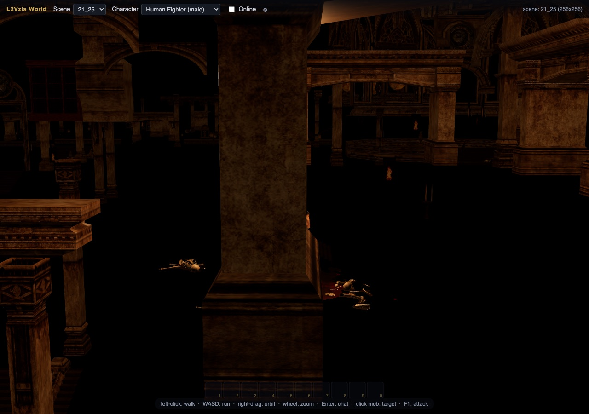
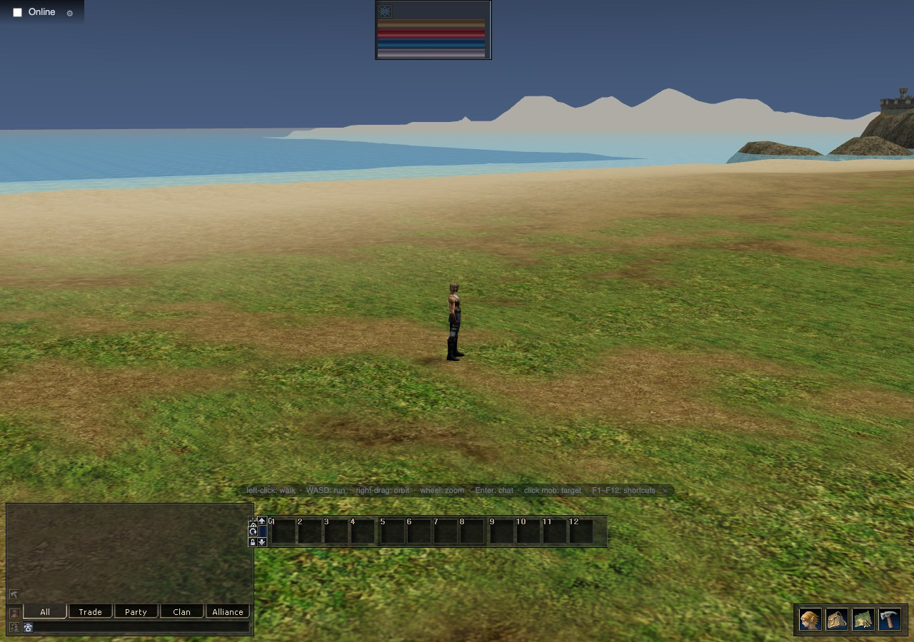
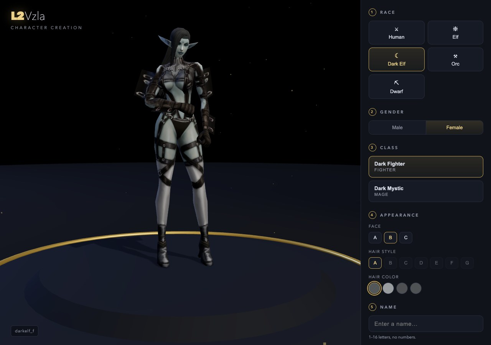
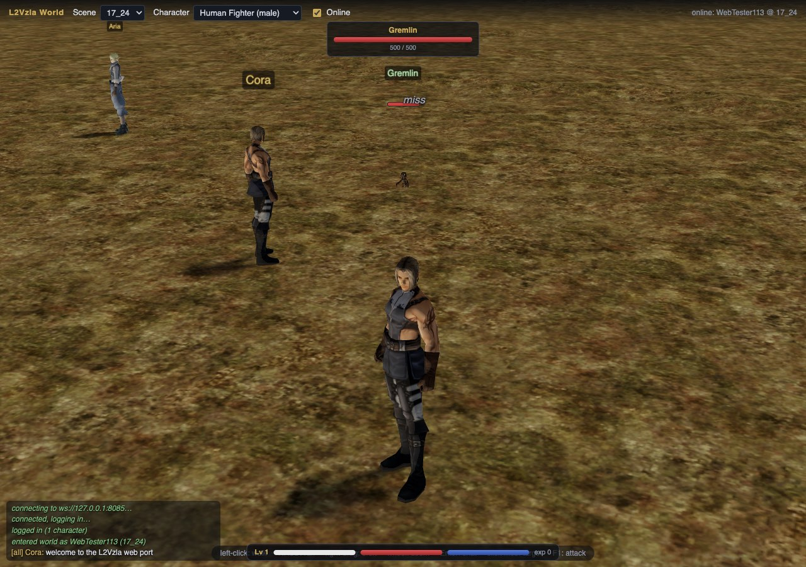
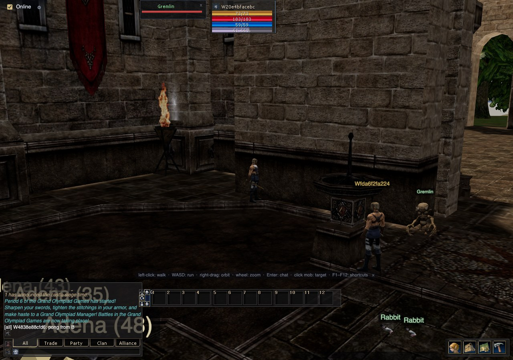
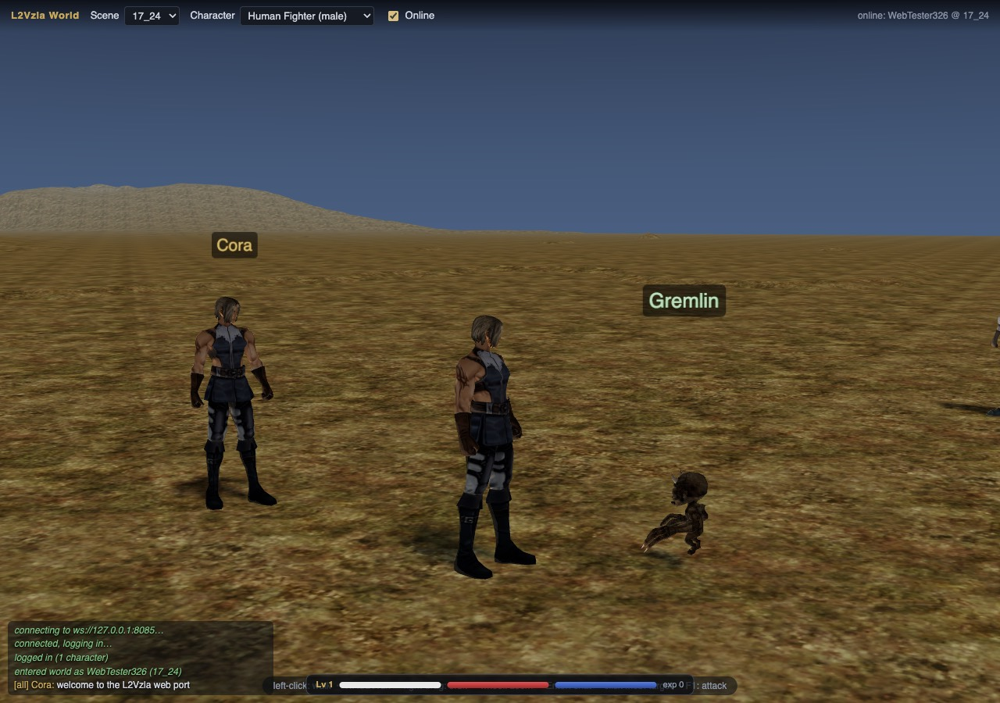
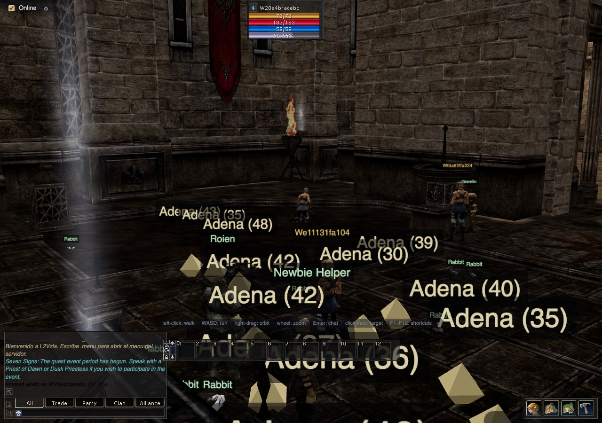
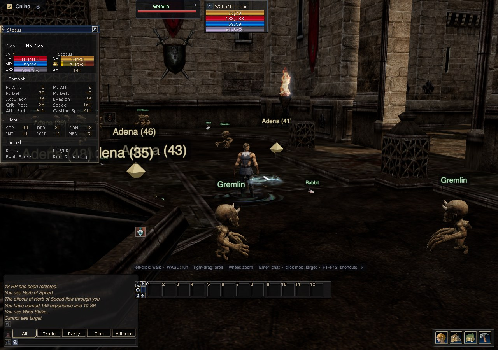
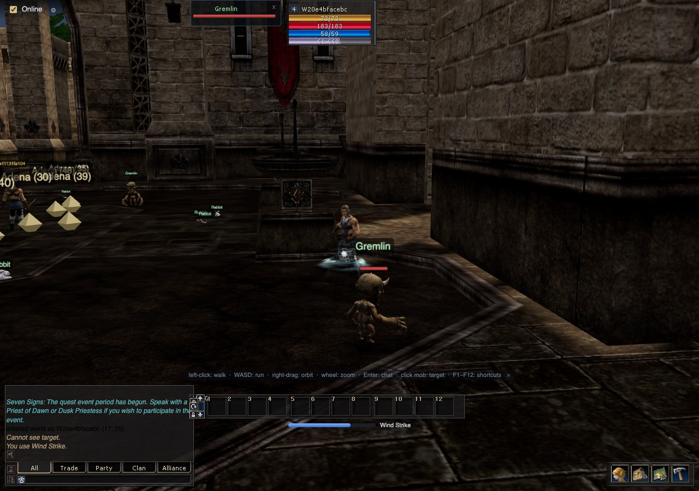
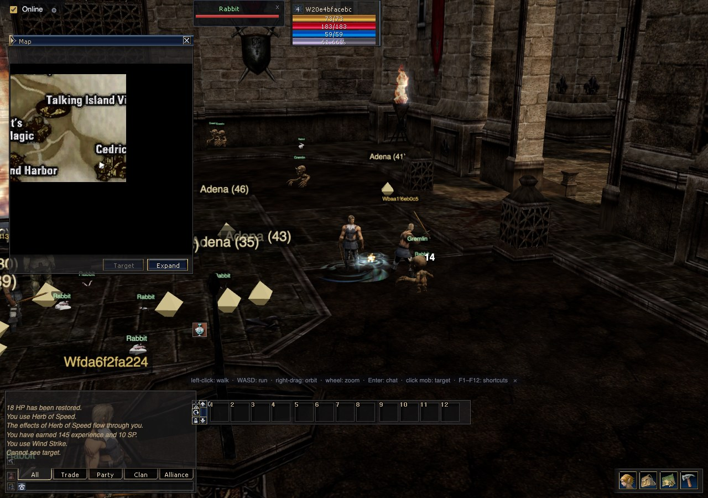

# ELBERA · Game gallery

[Project home](../README.md) · [Current coverage](PORT-COVERAGE.md) ·
[Elbera Tools](../tools/README.md) · [Capture provenance](img/README.md)

The browser game's development gallery, preserved from the earlier project
README. These are historical captures of this project's renderer and interface.
They show the work at the time of capture; current behavior and remaining gaps
are recorded in the coverage inventory. In particular, the older creator's hair
swatches and disabled choices have since been replaced with source-derived lists.

## Giran, equipment and the interface

Armor, a shield, city architecture and the browser interface in one development
frame. This is the original project hero, retained without compositing or edits.

## World

| Talking Island | Giran |
| --- | --- |
|  |  |
| Shoreline, water and terrain. | Plaza, monument and architecture. |
| **Elven Ruins** | **Coastal terrain** |
|  |  |
| An interior view from the BSP rendering work. | Water and terrain layers in an earlier browser build. |

## Characters and gameplay

| Character creation | Combat |
| --- | --- |
|  |  |
| Earlier creator layout; appearance controls have since changed. | A development combat session with target, damage and loot presentation. |
| **Multiplayer** | **Creature rendering** |
|  |  |
| Two player characters and chat in the earlier test session. | Original creature geometry presented by the browser renderer. |

## Interface and NPCs

| NPCs | Character sheet |
| --- | --- |
|  |  |
| NPCs, player characters and development overlays. | Character statistics and equipment-era UI. |
| **Skills and shortcuts** | **Interface composition** |
|  |  |
| Skill controls and system-message presentation. | An earlier stage of the original-interface reconstruction. |

These views preserve the project's visual history, including visible unfinished
details. They do not certify current collision, material, animation or UI parity.
The [new Elbera Tools gallery](../README.md#elbera-tools) shows the September
2026 inspection work, with each tool's actual scope described alongside it.
