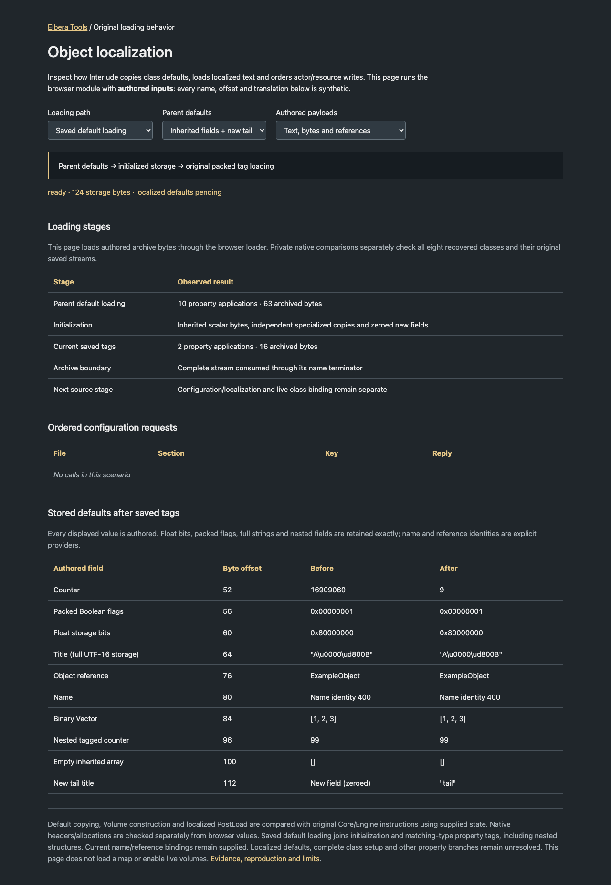

# Original object localization

The browser now has a source-bound implementation of `UObject.LoadLocalized`
context selection, inherited/nested property traversal and optional text lookup.
**145 authored cases** match the original control flow: **444,224 interpreted
instructions at 446 addresses**, **1,014 configuration requests** and **923 text
import calls**. No native DLL is executed.

The string path now also executes the original ImportText and assignment:
**145 joined cases**, **616,891 instructions at 572 addresses** and **923 exact
text copies**. Another **76 direct string cases** cover empty values, literal
text, UTF-16 and buffer identity. The browser stores the same text values.

Another **192 cases** now join original default string copying, Volume
construction and localized Brush/Actor/Object PostLoad: **260,384 interpreted
instructions at 1,002 addresses**, **528 deep copies** and **192 localization
invocations**. This checks the browser's initialization and PostLoad modules
together, with explicitly supplied class/default/configuration state.

This is a loading component, not completed volume startup. The current map
loader still leaves all 53 volume actors unsupported. Live class binding,
configuration parsing and other property importers remain unresolved. Existing
map geometry and terrain defects are unchanged.

## Elbera inspection page

Serve the existing world editor and open `test/actor-localization.html`. It runs
without game files, an account or a game server. Choose direct nested
localization, actor startup or flagged actor startup; then vary object context,
language and configuration response. The stage table shows default copying,
each localization call and the later resource/actor writes. Startup uses a
flat string copy list; direct mode separately exercises nested structures.
The before/after table shows actual browser string storage,
including values retained after missing or empty translations. Every displayed
name, offset and translation is **authored**. The page uses the same browser
module as the native comparison. A fourth path, **Class default copying**, shows
mixed strings, raw byte arrays and object references. Choose absent, partial or
complete parent storage and empty/nonempty payloads. New fields clear, copied
arrays use independent storage, and references retain identity. Its direct link
is `test/actor-localization.html?path=defaults`; this path isolates copying.
A fifth path, **Saved default loading**, joins initialization and packed tags.
It shows exact float bits, Boolean neighbors, full strings, supplied object/name
identities, binary and tagged structures, and saved overrides. Open
`test/actor-localization.html?path=tags`; its archive bytes are also authored.
Localized defaults and live class binding remain explicitly pending.



This is a complete, unmodified 1280 × 1854 browser capture of the tool, updated
29 September 2026. One hundred and two combinations
of its controls passed, including return to the initial scenario; no page or
console errors were captured. The existing game-test runner also captured and
inspected the page. This is not an official game panel or a gameplay screenshot.

## Recovered behavior

- The current class's `0x20` bit and current editor state gate localization.
- An object with index `-1` uses its class's outer/name. Other objects use their
  own outer/name, except flag `0x100` with a nested outer adds an object prefix.
- The original field iterator follows current child links, filters by the
  field class's property bit, then visits inherited structures. Saved export
  order is not a substitute for that linked order.
- A static array gets `[index]` keys only when its dimension exceeds one.
  Nonpositive dimensions perform no element work.
- A StructProperty recurses **before** the localized-property `0x8000` test.
  Nested localized fields therefore remain reachable through unmarked structs.
- Optional lookup tries the current language, then `int` after a miss. A
  case-insensitive `int` current language does not trigger another lookup.
  A successful empty translation does not import text or try the fallback.
- Before engine startup, or with a known null configuration pointer, the
  original returns the key itself. That is different from a missing entry in
  an available configuration provider.
- Nonempty text invokes the property's virtual `ImportText` with port flags
  zero. The original caller ignores its returned input pointer.

## Source identity and method coverage

| Input | SHA-256 |
| --- | --- |
| Owned Interlude `Core.dll` | `9462f87a5e77d21865e2e00264efd44df25feb47aa78f8a72e9cf66ce4e919bf` |
| Supplemental comparison `Core.dll` | `d83449b1cdf0ac717a98be9289caab03cb507324a696ef449e31369e28416639` |

The supplemental input is the existing pinned archive-2015 comparison. It
qualifies byte correspondence with the owned edition; it does not replace the
owned client as behavioral authority. Both files stay private.

`tools/ui/actor_localization_source.py` compares every byte of these ordinary
ranges and validates named exports, jump thunks, virtual slots and text operands.
Ranges use an exclusive end:

| Method or helper | Owned Core range |
| --- | --- |
| UObject.LoadLocalized | `1015f5e0–1015f6c4` |
| Recursive field worker | `1015f460–1015f559` |
| Property dispatch | `1015c690–1015c73f` |
| StructProperty cast | `101329a0–101329c2` |
| Property iterator constructor / advance | `10119210–1011923e` / `10114340–10114395` |
| UStruct / UClass inheritance getters | `10115950–10115954` / `10115a20–10115a24` |
| Rotating scratch string | `10152570–101525cc` |
| Localize, including the later startup/config-absent return | `10153e70–10153f9d` |
| Current language getter | `1015b9f0–1015ba2e` |
| Formatter wrapper / comparison tail call | `1012e080–1012e09d` / `1012dd00–1012dd05` |
| UTF-16 copy | `1012dd10–1012dd35` |

The later Localize return matters: stopping at its first `ret` would omit the
startup/config-absent branch. Full ordinary ranges are compared even where only
optional lookup is admitted for execution. Exception and unwind paths are not
qualified. Named globals bind editor/startup state, configuration, names,
language and the StructProperty descriptor. Source buffers and code bytes are
not included in the public fixtures or receipts published with this guide.

## Reproduce

Portable checks require Node and Python with Capstone 5.0.7, but no game files:

```sh
node --test editor/world/test/actor-localization.test.mjs editor/world/test/actor-loading.test.mjs editor/world/test/class-defaults.test.mjs
python3 -m unittest discover -s tools/ui -p test_actor_localization_native.py
python3 -m unittest discover -s tools/ui -p test_class_default_loading_native.py
```

The original comparison additionally needs both pinned private Core images:

```sh
python3 tools/ui/check_actor_localization_native.py \
  --core /private/owned/Core.dll \
  --comparison-core /private/comparison/Core.dll \
  --output tmp/actor-localization-evidence.json
```

The checker loads the source ranges into the existing admission interpreter,
then compares original calls and names with the actual browser module. It
checks stack/SEH restoration and nonvolatile registers, and records source
fingerprints. Cases include scratch-counter wrap, more than 256 sequential
scratch allocations, inherited fields, nested static arrays, Unicode text,
partial writes on lookup misses and all admitted context/gate branches.
Eleven authored interpreter checks cover partial-word preservation and completed
byte-to-word storage, 32-bit
effective-address wrap, UTF-16/word-register behavior, exact byte allocation,
compiler stack probes, narrow comparisons, qualified erased-import dispatch,
CDO memset boundaries, exact odd-byte array copies and the NEG/SBB
carry-dependent argument mask.
The localization, actor-loading and saved-default modules have 64 portable checks, including
missing metadata, provider failures, partial progress, complete string copies
and the repeated PostLoad calls.

## Default copying and localized actor startup

`--actor-startup` reuses the existing Core/Engine qualifiers and admission
interpreter. It adds no second execution engine. These original methods join
the localization and string routines already described here:

| Method | Owned range | Supplied state / boundary |
| --- | --- | --- |
| UProperty.CopyCompleteValue | Core `1016e050–1016e092` | Qualified string virtual slots, dimensions and stride |
| UObject.InitProperties | Core entry `1015fb00` | Current object/class/default buffer and string-only specialized-copy list |
| AVolume constructor | Engine entry `103d3b50` | Native constructor chain; current class/header retained |
| UObject.PostLoad | Core `10163c60–10163cb8` | Current object/class flags |
| AActor.PostLoad | Engine `1052f570–1052f65d` | Current rotation, no attachments, configuration and reflection |
| ABrush.PostLoad | Engine `1052fdd0–1052fe15` | Explicit null, separate or shared Model/Polys headers |

The inherited complete-copy method loops the current array dimension and calls
the string single-value virtual method. It copies all stored UTF-16 units,
including data after an embedded NUL. The original InitProperties raw copy
temporarily aliases the default string headers; its specialized-copy loop
clears each destination header before deep copying. The source headers and
allocations must remain unchanged. Known string slots beyond the default
buffer are cleared by the original tail initialization.

PostLoad first sets object bit `0x20000000`. Object bit `0x100` triggers the
UObject localization call; class bit `0x20` triggers another in AActor. Each
invocation sees the updated flags and independently applies the original
class/editor gate. Model/Polys writes and remaining actor updates follow.
The browser now preserves these calls, their order and earlier completed
imports when later work is unsupported. A flagged object whose class is
nonlocalized can skip localization without requiring configuration providers.
This does not remove the fresh-loader restrictions on localized subclasses.

The 192 authored comparisons cover absent, partial and full default buffers,
string dimensions one/two, Unicode and embedded-NUL storage, class/object/editor
gates, six configuration policies and resource aliasing. The native constructor
preserves the copied strings. The browser comparison consumes actual
`initializeActorStringProperties` and `postLoadBrushActor` results, including
configuration requests, imports, values and ordered writes. Non-string payload
fields are explicitly supplied after construction; no full actor-tag loader,
reflection linker or live class lifecycle is claimed. Successful byte copying,
zeroing and allocation remain providers.

In addition to the pinned Core inputs above, this mode requires:

| Input | SHA-256 |
| --- | --- |
| Owned Interlude `engine.dll` | `07b24af4ab55e4230d0a7949df5b07565319e62a1b20f38fefb16ebe54821ad0` |
| Supplemental comparison `engine.dll` | `508974c711f207402719e92737e211a2f029c95c2f68fc0e1c31fcbb9dbb232d` |

```sh
python3 tools/ui/check_actor_localization_native.py \
  --comparison-core /local/reference/system/Core.dll \
  --actor-startup --comparison-engine /local/reference/system/engine.dll \
  --original-strings --output tmp/local-localized-startup.json
```

Owned images default to `assets/interlude/system`; `--core` and `--engine`
override them. `--actor-startup` and `--comparison-engine` must appear together.
The optional `--original-strings` also reads the original saved package values
described in the [string-loading evidence](native-class-defaults-evidence.md#saved-string-loading-and-copying).
Omit that option for only authored cases; pinned private DLLs are still needed.
Keep full evidence receipts and all original inputs private.

## Class-default initialization and configuration gate

The same verifier now enters `UObject.InitClassDefaultObject` before
`InitProperties`. It checks the complete 52-byte object header: the current
class's vtable and class pointer, both index fields set to minus one, the
conditional outer pointer and all remaining cleared words. The initializer
passes the **parent class** to InitProperties. Its two qualified CDO callers,
UClass.Register and UClass.Serialize, both pass zero for the outer/instancing
argument; the comparison also exercises nonzero arguments explicitly.

**60 authored cases** check absent parents, parents without defaults,
header-only defaults, partial/full inherited fields, three initial byte patterns,
Unicode, embedded NULs and nonaliased string storage. Original execution uses
17,982 instructions at 277 addresses and makes 84 deep copies. The existing
browser `initializeActorStringProperties` matches the string projection. All
13 header words, scalar copy/zero bytes, the seven InitProperties arguments,
parent storage and nonvolatile registers are checked separately. Other
specialized-copy types, tagged defaults and localization are not executed by
this suite. It is not a complete class-default-object loader.

The initial LoadConfig gate chooses an explicit ConfigClass when provided,
otherwise the object's current class. If that class's bit `4` is clear, the
original method returns before accessing parent configuration, filenames or
GConfig. **1,536 authored cases** cover every low byte with three upper-word
patterns and both class-selection paths. Half return; half stop at the first
configuration-enabled continuation. Unreadable filename/parent providers help
detect accidental reads on the skip path. Enabled configuration is not emulated.

| Source binding | Owned Core range, exclusive end |
| --- | --- |
| InitClassDefaultObject | `1015fe10–1015fe9f` |
| InitProperties | `1015fb00–1015fc7a` |
| GetPropertiesSize / GetDefaultObject | `1010b310–1010b314` / `10115bb0–10115be5` |
| appMemset CRT boundary | `1012da20–1012da25` |
| LoadConfig entry and gate / normal return | `10166740–1016678c` / `10166ac4–10166ad7` |
| UClass.Serialize initializer / configuration callers | `10135325–10135336` / `1013534a–1013536c` |
| UClass.Register initializer / configuration callers | `10133a44–10133a55` / `10133ab1–10133ad3` |

All eleven ranges and six named thunks match the pinned comparison Core.
UClass's size virtual slot is bound independently. These are complete ordinary
method bodies where named above, with deliberately partial caller/gate ranges.
CRT memset/memcpy and successful allocation remain explicit providers; native
DLLs and operating-system I/O are never executed.

The optional source check reuses the existing registration and class-prefix
qualifiers. It reads Object, Actor, Brush, Volume, BlockingVolume, MusicVolume,
PhysicsVolume and WaterVolume from the
[pinned class packages](native-class-defaults-evidence.md#original-source-binding).
Unlike the previously recovered `0x200000` reference-class flag, config bit `4`
**can be inherited** through Register's `0xf86ec` mask. The reader therefore
retains native/saved parent variants as well as leaf words. Constructor-added
`0x12` flags cannot set the consumed bit. WaterVolume uses its saved/script
ancestry; no native registration is invented.

All eight source profiles agree on a clear config bit. **28 original gate
executions** cover every resulting word through both class-selection paths
(812 instructions at 30 addresses). This closes the ordinary nonconfig gate
for those source stages. It does not construct a live registry, model external
class mutation, supply default values or prove that localization is absent.
LoadLocalized remains a separate call with separate inputs.

```sh
python3 tools/world/inspect_actor_declarations.py --default-config --check
python3 tools/ui/check_actor_localization_native.py \
  --comparison-core /local/reference/system/Core.dll \
  --actor-startup --comparison-engine /local/reference/system/engine.dll \
  --default-config --output tmp/local-class-default-initialization.json
python3 -m unittest discover -s tools/ui -p test_actor_localization_native.py
```

The native verifier's `--default-config` requires `--actor-startup` and the
three pinned packages. Without it, the original authored-only mode retains its
DLL-only input contract. The declaration inspector reads owned DLLs/packages
without comparison files; supplemental binding is performed by the native
verifier. Its summary reports eight skipped profiles and leaves classes outside
this bounded family unresolved. Full receipts and source inputs stay private.
These additions belong to the full-repository Elbera Tools evidence suite;
they do not change the current standalone Core archive or the browser UI.

The complete specialized-copy list is covered by the additional suite below.
Remaining volume work includes complete actor-tag loading, localized default
lookup, class binding and world startup.
All 53 live volumes remain unsupported. A source-stage skip is not a completed
volume or a completed browser client.

## Complete specialized default copies

The browser's `initializeClassDefaultProperties` now projects the specialized
values of the original CDO initializer. It requires the complete recovered
current list, parent sizes/storage and an **explicit null instancing object**.
It accepts strings, raw-copy arrays and object references. Scalar bytes and
object headers remain outside the browser helper; the native comparison checks
them separately. This component does not load an entire class.

The verifier reuses the existing reference-property bindings and shared array
range, adding no second interpreter. Named thunks, the array/object virtual
copy slots, allocator and editor/UCC globals are checked against the pinned
Core images. Additional original ranges are:

| Method | Owned Core range, exclusive end |
| --- | --- |
| UArrayProperty.CopyCompleteValue | `1016fe90–1016ff66` |
| UObjectProperty.CopyCompleteValue | `10171740–101717e9` |
| FArray.Realloc | `101522e0–10152346` |

For array inners whose `0x400000` bit is clear, the original allocates the
source element count and copies exactly count × element-size bytes. Destination
count and capacity agree; spare parent capacity is not copied. Empty results
have a null data pointer. The browser retains a separate immutable byte array;
it does not reinterpret embedded references or elements. In this recovered
family, all ten Actor arrays on the specialized-copy list take this branch.
The branch for inners needing specialized copies remains unsupported.

Object CopyCompleteValue can construct subobjects for other callers. Both
original CDO callers pass zero for the instancing argument, and the original
InitProperties forwards zero to the virtual copy. For that path, references
retain identity even when the property's specialized-copy flag is set and
editor/UCC modes vary. The browser rejects nonnull or unknown instancing inputs.
It does not substitute CopySingleValue for general object copying.

**192 authored cases** execute 63,544 instructions at 319 addresses and 336
specialized copies. They cover absent/header-only/partial/full parents,
reordered lists, empty/nonempty arrays, element strides 1/3/4/8, adjacent
reference/string/array fields, UTF-16, embedded NULs and all editor/UCC pairs.
Each checks exact copy-list traversal, scalar copy/zero bytes, unchanged parent
headers/allocations, nonvolatile registers and the browser values. Successful
allocation and bounded nonoverlapping CRT memcpy remain explicit providers.

The optional `--default-copies` adds **96 cases** using complete recovered
lists and sizes for Object, Actor, Brush and the five volume classes:
97,046 instructions at 319 addresses and 840 specialized copies. The original
class metadata comes from the
[separately verified inherited linker](native-class-defaults-evidence.md#inherited-class-metadata).
**Payloads are still authored**; this does not claim to reconstruct original
CDO values or establish live world startup. Source metadata and fingerprints
are recorded only in the private receipt.

```sh
python3 tools/ui/check_actor_localization_native.py \
  --comparison-core /local/reference/system/Core.dll \
  --default-copies --output tmp/local-class-default-copies.json
```

The default invocation retains its Core-only private-input contract and runs
the 192 authored cases. `--default-copies` additionally requires the pinned
owned Core/Engine DLLs and Engine/Core/GamePlay packages at
`assets/interlude/system`; it does not require `--actor-startup` or a comparison
Engine image. The package and DLL hashes are checked explicitly against the
edition listed in this guide and the linked class evidence. Other optional
flags retain their own requirements. Unknown source slots, overlapping fields,
incomplete array bytes and unsupported inner branches fail before exposing a
partial browser result. All inputs remain unchanged.

The inspector and native verifier belong to the full-repository Elbera Tools
suite. The separate Core archive is unchanged. All 53 live map volumes remain
unsupported until saved-tag admission, localized defaults and the actual
class/world startup sequence are joined.

## Original saved class-default loading

`loadClassDefaultProperties` in `editor/world/js/class-defaults.js` now joins
parent initialization, specialized copying and matching-type packed property
tags. The browser retains all scalar bits and projects native string, array,
name and reference slots into separate values. Native object headers remain
outside that projection. The helper reuses the existing default-copy operation;
it does not introduce a second implementation of inherited string/array copies.

The new Elbera verifier, `tools/ui/check_class_default_loading_native.py`, reads
the **actual saved streams** from the pinned original packages. In parent order,
it interprets original `InitClassDefaultObject` followed by
`UStruct.SerializeTaggedProperties`, then compares the browser result. All
eight classes match: **74 top-level tags and 83 property applications**, using
**83,897 original instructions at 1,030 addresses**. The additional nine
applications are nested tags inside three saved Scale structures.

| Original class | Own saved tags |
| --- | ---: |
| Core.Object | 0 |
| Engine.Actor | 36 |
| Engine.Brush | 9 |
| Engine.Volume | 3 |
| Engine.BlockingVolume | 6 |
| Engine.MusicVolume | 2 |
| Engine.PhysicsVolume | 7 |
| GamePlay.WaterVolume | 11 |

Each class check covers the complete projected body, tag application order and
offsets, archive positions, exact termination and ordered name/reference
provider calls. All thirteen native header words, nonvolatile registers and
earlier initialized bodies/string allocations remain unchanged by tag loading.
The source corpus contains no saved array tags; its initialized array headers
remain empty. Nonempty inherited raw-array copying is covered by the separate
copy suite above, not by an invented saved-array example.

This joins the previously qualified packed-tag and transform-loading ranges,
including `10132f10–10133161` (tag serialization), `101346e0–10134cd8` (tagged
property traversal) and `10131090–10131137` (application). Additional complete
Core ranges bind Byte and Name serialization, property type IDs and casts:
`10170c00–10170c15`, `1016ef60–1016ef73`, `10170ae0–10170ae7`,
`1010b970–1010b973`, `10132a60–10132a82` and `10134670–101346ca`.
Ends are exclusive. Thirteen fixed-name registrations and their original text
are compared, including None and the Vector/Rotator/Color identities that select
binary structure loading. Other structures use nested tags. Ten property-class
descriptors and forty virtual slots are bound to the same pinned Core pair.

The private inputs are the owned Core/Engine DLLs and `Core.u`, `Engine.u`,
`GamePlay.u` used by the
[inherited linker](native-class-defaults-evidence.md#inherited-class-metadata),
plus the pinned comparison Core listed above. All five owned input fingerprints
are checked exactly; the full receipt records them and the implementation hashes.
Owned inputs currently use the repository's `assets/interlude/system` layout.
Node and Python with Capstone 5.0.7 are required. No DLL is executed.

```sh
python3 tools/ui/check_class_default_loading_native.py \
  --comparison-core /local/reference/system/Core.dll \
  --output tmp/local-class-default-loading.json
```

**Keep this receipt private:** it contains decoded original defaults. The public
fixture and inspector use only authored data. Four browser tests cover exact
bits, inherited overrides, parent preservation, six inspector variants and
malformed/unresolved inputs. Three additional portable interpreter checks cover
indirect tag-size dispatch, SETE register preservation and bounded archive reads.
An additional Node-backed check verifies the requested comparison-module path.
The shared interpreter now promotes a partially known word to ordinary storage
after all four bytes have been written, with a dedicated regression.

This is the file-123 **pre-localization default body**, not complete class
startup. Recomputed metadata, already-preloaded structures, successful allocation
and synchronous current-name/object-reference resolution remain explicit
providers. Native `ULinkerLoad.IndexToObject` and the name registry do not run.
Rejected tags, type conversions, nonempty saved arrays, other editions, saving
and exception paths remain outside browser admission. Exact payload boundaries
and terminated strings are conservative admission checks, not claims that the
original client enforces those same checks. Configuration/localization, live
metadata binding and actual world startup remain separate. All 53 live map
volumes remain unsupported. The full browser-client goal is still incomplete.

## Original string imports

`qualify_string_property_text` reuses the same pinned Core images and validates
the UStrProperty ImportText virtual slot and named string/array helper thunks.

| Method or helper | Owned Core range | Coverage |
| --- | --- | --- |
| UStrProperty.ImportText | `10173ae0–10173b3a` | Guarded prefix only: port flag `2` clear |
| FString wide assignment | `10114fd0–1011501e` | Complete ordinary body |
| FArray.Realloc | `101522e0–10152346` | Complete ordinary body |
| UTF-16 strlen | `1012db60–1012db77` | Complete body |
| Compiler stack probe | `1017ece0–1017ed0b` | Complete normal control flow, including page-touch loop |

The ImportText prefix is **not** the whole method: its taken flag-2 branch
enters a later quoted parser. Localization passes zero and takes the admitted
prefix. It assigns the input text and returns the original input pointer.
Whitespace, quotes and backslashes are literal on this path. Copying stops at
the first zero UTF-16 code unit; surrogate code units are preserved unchanged.

FString assignment skips work when the current data pointer equals the source
pointer. Otherwise it obtains the terminated text length, sets count/capacity,
reallocates two bytes per code unit and copies the exact byte count. An empty
assignment requests zero allocation and skips copying. The interpreter's
allocator preserves unknown bytes and supports sizes that are two, rather than
four, byte aligned. It does not round string counts or allocation sizes.

The 76 direct cases execute 24,852 instructions at 127 addresses. They include
36 equal-buffer cases, four empty releases, Unicode/unpaired surrogates, literal
quotes/whitespace, embedded terminators and text up to 1,023 code units. Source
bytes, neighboring guards and nonvolatile registers are preserved, and the
original input pointer is returned. Count/capacity and allocator arguments are
checked independently of the browser value comparison. The joined cases run
the original iterator, lookup, string importer and assignment together; fields
with no import retain their supplied values.

Allocator success and nonoverlapping byte copying remain supplied providers.
The compiler's stack probe executes against explicitly supplied committed stack
words; this does not emulate OS guard faults, failed allocation or SEH handling.
The browser uses immutable UTF-16 strings instead of duplicating the native
heap. It compares the resulting property text, not allocator addresses or heap
capacity. Current string slots and original property dispatch must be known;
missing storage and other property types stay unsupported. Supplied string
slots must have disjoint 12-byte header ranges; partial overlaps or wrapped
relative offsets are explicitly rejected. A shared exact offset is one Map slot.

## Runtime contract and remaining limits

[`actor-localization.js`](../editor/world/js/actor-localization.js) exports
`actorLocalizationContext`, `localizeOptionalText`, `loadActorLocalized`,
`importStringPropertyText` and `copyStringPropertyValues`.
`loadActorLocalized` accepts current `object`, `classInfo`, `isEditor`, `environment` and a
synchronous `importText` provider. Its structure graph must be frozen and use
explicit `super` and `struct` references or null. Fields retain current linked
order, identity, name, classification, dimension, size, offset and flags.
Missing information is unsupported rather than an empty structure or zero.

`environment.readConfig({section,key,filename,capacity})` returns
`{status:'ready', found, value}`. Here `value:null` explicitly leaves the
existing output buffer unchanged; a string writes it, including an empty
string. A failed lookup can still have written text before the fallback.
`readConfig:null` means known absent configuration; undefined means unresolved.

`importText({field,offset,text,portFlags:0})` returns a completion status. A caller
with qualified string-property dispatch can forward the call to
`importStringPropertyText({...call, propertyKind:'StrProperty', storage})`, where
`storage` is a Map of current byte offsets to existing string values. This
updates the supplied slot and returns the stored value. It never invents a slot
for missing source storage. Other property types need their own operations.
Earlier imports remain visible if later metadata or a provider is unsupported.
Providers must be synchronous and nonreentrant; lookup text and metadata must
remain stable during the operation.

`copyStringPropertyValues` requires known source/destination Maps and qualified
string layout. It retains complete immutable string contents. Missing slots,
overlapping headers, partially overlapping arrays and overflowing addresses
are explicit admission failures; pointer/count/capacity stay native-verifier
concerns. `initializeActorStringProperties` in `actor-loading.js` uses this
operation for the known string subset of InitProperties. Its supplied fields
represent the current specialized-copy list restricted to strings, never
saved export order. It rejects fields crossing its admitted buffer boundaries.
It neither builds a CDO nor initializes other property kinds.

The original control-only suite keeps ImportText as a provider. The joined
string suite replaces that boundary with the original string method. Both use
explicit CRT formatter/language-comparison and configuration providers. Thus
the result does not prove native INI parsing, CRT edge behavior or OS allocation. The
browser admits ASCII language identifiers and terminated text below the native
1024-cell scratch capacity. Its conservative filename limit is 255 UTF-16
cells; this is a safety boundary, not a recovered game rule. Relative offsets
must not wrap. Recycling an active nested-prefix scratch buffer is explicitly
unsupported, while ordinary sequential ring reuse is supported.

The [saved declaration census](native-static-actor-bounds-evidence.md#volume-construction-and-property-declarations)
finds only Volume.LocationName localized in the inspected ancestry. Source
offsets/defaults and the composed loading operations are now available, but
current class setup, configuration context and live effects remain unresolved.
Next are those providers and the actual volume/world startup join.
Existing standalone release ZIPs are
unchanged; this page, module and native verifier are repository Elbera Tools.
