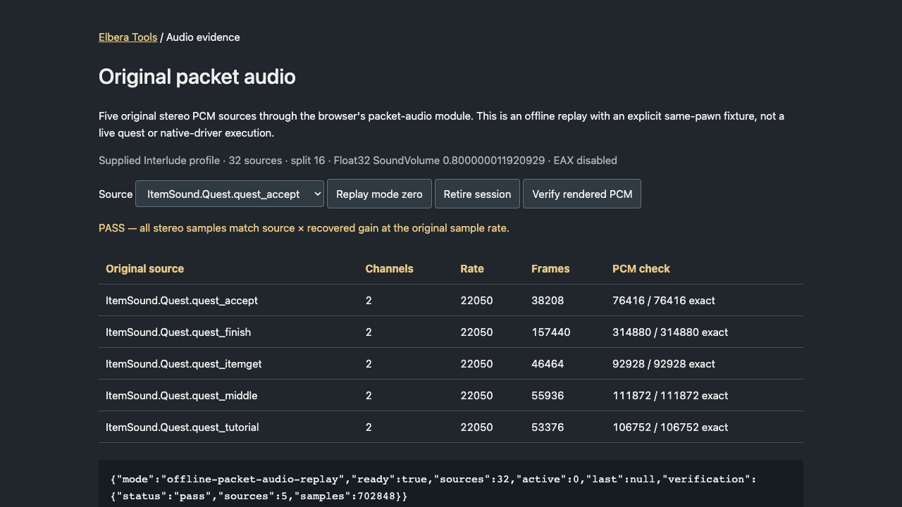
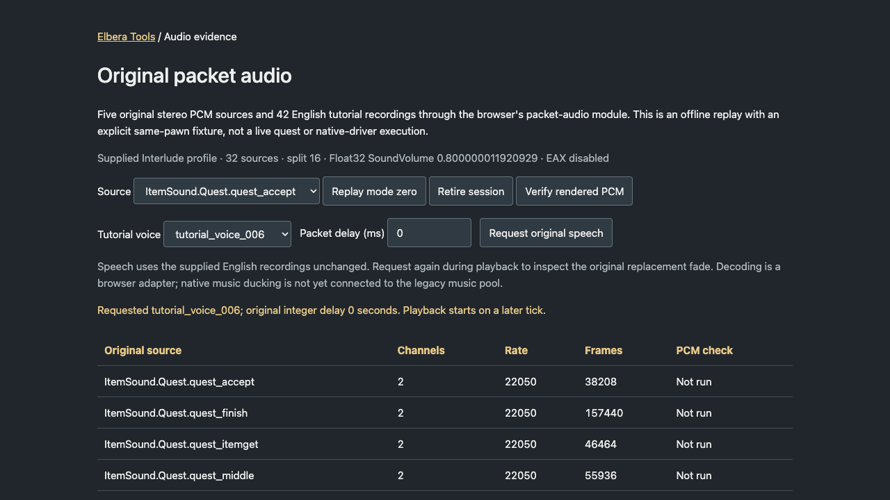

# Original PlaySound and quest audio evidence

Elbera Tools preserves the original `0x98` packet and five original stereo
quest/tutorial sounds. The browser now connects the bounded mode-zero path to
its verified priority/selection/stop components and real Web Audio sources.
The admitted path uses an explicit current self-pawn viewport, predecoded
stereo buffers and the supplied EAX-disabled profile. Mode-two tutorial speech
also uses original recordings and recovered controller timing/fades, as bounded
below. This is partial audio
integration, not complete driver or gameplay parity.

[Open the local audio inspector](../editor/world/test/packet-audio.html) after
starting the asset server. It offers audible offline replay, session retirement
and an actual Web Audio PCM comparison. It never connects to a game server.



*Actual tool capture. The same-pawn state is a labeled fixture; these results
are not evidence of a live quest or the Windows driver's audible output.*

## Reproduce

Supplied local Interlude `Engine.dll`, `Core.dll`, `ALAudio.dll` and `ItemSound.uax` are
required for source checks. These tools read originals, decode only in memory,
and never execute the client or access an account.

```sh
python3 tools/ui/check_playsound_native.py --check
python3 tools/audio/export_quest_sounds.py
python3 tools/audio/export_quest_sounds.py --check
python3 tools/audio/native_audio_profile.py
python3 tools/audio/native_audio_profile.py --check
python3 tools/audio/export_tutorial_voice.py
python3 tools/audio/export_tutorial_voice.py --check
python3 -m unittest discover -s tools/audio -p test_native_audio_profile.py
python3 -m unittest discover -s tools/ui -p test_playsound_native.py
python3 -m unittest discover -s tools/audio -p test_quest_sounds.py
node --test gateway/test/playsound-packets.test.js
node --test editor/world/test/native-audio-voices.test.mjs editor/world/test/native-packet-audio.test.mjs
node --test editor/world/test/native-speech.test.mjs
python3 -m unittest discover -s tools/audio -p test_tutorial_voice.py
python3 tools/ui/check_playsound_native.py --check --voice-selection
python3 tools/ui/check_playsound_native.py --check --priority --stop
```

To check the additional bindings, supply both matching comparison images:

```sh
python3 tools/ui/check_playsound_native.py --check \
  --comparison-engine /path/to/comparison/engine.dll \
  --comparison-core /path/to/comparison/Core.dll
```

Add `--speech` to that comparison command for the controller and fade differential.
It checks **1,158 controller cases, 270 fade cases and 140 signed packet delays**
against retained instructions (66,467 interpreted instructions), with named external
call results supplied as explicit synthetic observations. It does not execute a DLL.

Both paths are required together. Unsupported fingerprints fail before any
comparison; the original-only command retains its original unresolved result.
See the [supplemental binding check](#supplemental-binding-check).
`--voice-selection`, `--priority` and `--stop` additionally require Node and
compare the actual browser module against interpreted instructions from the
supplied original ALAudio. They can be combined with each other and the two
comparison-image options.

The exporter compares every output byte with a fresh extraction in `--check`.
Its default private receipt is `tmp/restart-audit/quest-sounds.json`. Original
containers, generated audio, metadata and receipts remain ignored; only the
tools and synthetic tests belong in public source control.

## Packet and mode evidence

The pinned Engine registers opcode `0x98` at `0x10837b0b`; the decoder at
`0x104108e0` uses original format `dSdddddd`. Its eight values reach the named
`UGameEngine::OnPlaySound` through vtable slot `+0x648`.

The gateway preserves them as:

```js
{ op: 'playSound', soundType, sound, objectFlag, objectId, x, y, z, delay }
```

Malformed/trailing packet bytes are rejected before emission. Unknown modes
and values are retained. The bridge forwards transient sounds only from the
current entered session; it does not replay sounds received before entry or
after session replacement. These are browser session boundaries, not claims
about native queuing.

In the original mode-zero branch (`0x1049dfd4`), the source actor is the current
viewport controller's pawn and the supplied position is that pawn's Location.
The handler consumes but ignores packet object flag, object ID, XYZ and delay
in this branch. It calls the audio driver's `PlaySoundW` with volume `1`, pitch
`1`, slot `0` and flags `0`. The radius comes from pointer slot `0x11d8dc10`,
unresolved in the owned image alone. The optional matched comparison binds it
to Core's original `GAudioDefaultRadius`, whose retained value is `80`.
Modes one and two have
separate paths and are outside this implementation.

## Exact original stereo assets

The five unique original Sound exports are grouped under `ItemSound.Quest`.
The configured server uses the short references in this table; matching each
unique package/leaf is checked, without inventing a general name resolver.

| Wire reference | Original export | Frames | WAV bytes |
| --- | --- | ---: | ---: |
| `ItemSound.quest_accept` | `ItemSound.Quest.quest_accept` | 38,208 | 152,876 |
| `ItemSound.quest_middle` | `ItemSound.Quest.quest_middle` | 55,936 | 223,788 |
| `ItemSound.quest_finish` | `ItemSound.Quest.quest_finish` | 157,440 | 629,804 |
| `ItemSound.quest_itemget` | `ItemSound.Quest.quest_itemget` | 46,464 | 185,900 |
| `ItemSound.quest_tutorial` | `ItemSound.Quest.quest_tutorial` | 53,376 | 213,548 |

All five contain complete PCM WAV containers at export byte nine: two channels,
22,050 Hz, 16 bits. The exporter preserves all **1,405,916 bytes**, including
both channels. `/audio/quest-sounds.json` records full original references,
source bank/export/WAV SHA-256 hashes, format, frames and URLs of the form
`/audio/quest/quest_finish.wav`. It provides no mono fallback.

The original `FWaveModInfo::ReadWaveInfo` binds the channel and sample-width
fields. `UALAudioSubsystem::RegisterSound` reads them at `0x10009381` and
`0x100093a4`; the stereo/16-bit branch chooses OpenAL format `0x1103` and uploads
it at `0x100093eb`. OpenAL specifies that multichannel buffers bypass its 3D
spatialization. This does **not** bypass an application's manual gain changes.
See [OpenAL 1.1 specification, §5.3.1](https://www.openal.org/documentation/openal-1.1-specification.pdf).

The historical general SFX exporter downmixes originals to mono. That changes
the source channel semantics and remains a separate fidelity gap.

## Playback boundary and next source check

The initial driver call compares the supplied pawn position with the viewport
pawn position, yielding zero distance at that call. The driver also retains
the source actor and refreshes its position during `Update` (`0x1000de82`).
However, per-frame manual attenuation uses the supplied scene node's `+0x1bc`
position (`0x1000cfb5`, `0x1000e1fd`); stereo alone does not prove constant gain.

The follow-up trace corrects the constructor location: `0x1058f1d7` is in the
viewport-reset branch. Ordinary `UGameEngine::Draw` constructs the player node
at `[ebp-0x424]` at **`0x1058fefe`**, immediately before passing that same address
to audio vtable `+0x74` (`0x1058ff8b`), the named `Update`. The scene's `Render`
call follows at `0x1058ffd4`. The constructor receives the viewport controller,
delegates to `FCameraSceneNode`, and its controller/pawn branch copies
Pawn.Location into node `+0x1bc` (`0x10655730–0x1065574f`), separately from camera
coordinates at `+0x194`. The controller class identity is named, but the helper's
type-query call at `0x1056b250` is six recovered NOPs in the owned image.
The optional comparison binds that call to Core's `UObject::IsA`. A complete
indirect-write/callback audit remains outside this proof.

The following driver details are now independently pinned:

- The APawn vtable's `+0x2f8` is named `AActor::IsAAmbientSound`; it returns zero.
  Ordinary pawn sounds therefore bypass the ambient initial zero-gain branch.
- Plain PCM registration supplies buffer flags zero. Combined with the handler's
  flags zero, the voice follows its actor and reaches the ordinary manual-gain
  branch. This branch jumps directly to `AL_GAIN`, bypassing fade-state gain
  handling. It does not become an ambient sound because the WAV is stereo.
- Both initial and per-frame dry gain use
  `clamp(volume * (R*50 - distance) / (R*50), 0, 1)`. The multiplier is bound by
  ALAudio's named import to the original Core export, whose value is `50`.
  At zero distance, **finite nonzero R cancels**. No particular radius value
  needs to be invented for that conditional algebraic result.
- The native assertion is the literal **`Radius`**, not `Radius > 0`.
  Instructions `0x1000a72f–0x1000a739` reject zero but also admit negative and
  unordered values. It is not proof that the unresolved input is finite.
- Reflected `UseEAX` is driver field `+0xe4`. Initialization leaves `EAXSet`
  null when disabled or unavailable. When present, the same ordinary sound
  submits separate radius-dependent values through EAX: the initial smoothed
  radius is `max(R,1)`, then its ratio to R enters the filter calculation.
  Consequently the dry-gain reduction does not prove EAX equivalence. No
  occlusion/obstruction property names are assigned to the numeric EAX calls
  without their separate API binding.
- `SetSoundVolume` rescales the stored gain of existing ordinary SFX voices
  (`0x10006e08–0x10006e14`) and updates `AL_GAIN`. Source gain one does not mean
  bypassing the user's mixer.

The portable gain tests are exact-real algebra witnesses and regression checks
for the nonzero assertion. They are explicitly **not** native floating-point
emulation, execution evidence, or proof of the missing radius import. The
conditional dry-stereo contract requires the same valid pawn at both snapshots,
finite nonzero R, ordinary flags-zero PCM, and no EAX processing. The general source verifier retains `conditional-reduction-only`: it does not
execute callbacks or observe a live original viewport. The bounded browser
adapter below supplies its own explicit same-pawn state; it does not claim to
close that whole-program evidence boundary. The optional comparison closes the two import identities within its
documented correspondence boundary. It does not close the remaining conditions.

The packet adapter does not substitute a generic UI sound or mono fallback.
Full mixer behavior, EAX/reverb, alternate viewports, shared allocation across
all game sounds and modes one/two remain outside this checkpoint. The verifier pins
source identities and instructions; it does not claim that the original client
was executed or that browser audio parity has been demonstrated.

## Radius and camera binding inventory

The follow-up verifier now checks **205 instruction anchors**. An independent
word subtraction and reverse-addition round trip from the pinned raw Engine
reproduces the zero pointer at `0x11d8dc10` and six NOP bytes at `0x1056b250`.
The shared decoder therefore did not manufacture these missing values/calls.
This does not establish who produced the bytes or whether/how startup restores
them; see [the recovery boundary](native-engine-recovery-evidence.md).

All 29 literal occurrences of the radius-slot address in the recovered image
decode as direct pointer loads. Unknown byte shapes fail the inventory check
instead of being omitted. The named `APlayerController::execClientHearSound`
also loads this slot when its radius argument is zero (`0x106a11af–0x106a11cb`),
then passes that value to audio slot `+0x80` (`0x106a121b`). This establishes a
default-radius role shared with mode-zero quest sound, not a finite value or
named provider. Literal loads do not exclude indirect/computed initialization
or later runtime writes.

The raw ordinary PE import directory lists only `KERNEL32.dll` and
`COMCTL32.dll`. It contains no Core binding for the slot or camera helper.
Core's separately named `GAudioDefaultRadius` and the driver's named import
do not prove that this Engine slot points to that export. Assigning its value
here would still be an unsupported substitution.

The original-only receipt retains the raw-roundtrip hashes and 29-address
inventory in `bindingBoundary`; its status remains `unresolved`. That result
is distinct from the optional correspondence check below. Neither check
executes or repairs the owned binary.

## Supplemental binding check

A fresh ordinary browser fight on 28 September produced two unhandled
`playSound` events, making this an observed beginner-flow gap. The recorded
warnings did not expose the sound references; they do not identify which of
the four quest assets, or another sound, the server requested.

The verifier compares these additional pinned inputs:

| Comparison input | SHA-256 |
| --- | --- |
| Engine.dll | `508974c711f207402719e92737e211a2f029c95c2f68fc0e1c31fcbb9dbb232d` |
| Core.dll | `d83449b1cdf0ac717a98be9289caab03cb507324a696ef449e31369e28416639` |

Three blocks, totaling 417 bytes, match after only explicit named class/global
relocations, named imported calls at erased sites, and unchanged direct-call
targets are accounted for:

| Owned interval (end excluded) | What the correspondence establishes |
| --- | --- |
| `0x1049dfd4..0x1049e0af` | Complete mode-zero lookup and driver dispatch; named Sound lookup/load/type imports and default-radius pointer |
| `0x1056b240..0x1056b262` | Controller cast helper uses the named controller class and `UObject::IsA` |
| `0x106556d1..0x10655775` | Camera node's separate audio-position choice and call to the matched cast helper |

The comparison radius IAT slot `0x11d8dc0c` names
`Core.?GAudioDefaultRadius@@3MA`. Both original Core files export identical
four-byte Float32 `80` data. The verifier checks that data through each named
export. It does not infer the radius from how the game sounds. The helper
thunk at `0x10312445` is also checked, so a nearby `IsA` occurrence cannot stand
in for the camera's actual call. Undeclared surrounding-byte differences fail.

The receipt reports `matched-supplemental-bindings` separately from the still
conditional dry-gain result. This is correspondence evidence, not archive
authentication or proof of how the protected owned client restores its imports.
No client files or decoded bytes are published.

The next integration dependency is the state between camera-node construction
and audio update. Named `FCameraSceneNode::UpdateMatrices` follows the audio
position stores, and Draw calls `UViewport::IsDepthComplexity` and render-interface
slot `+0x10` before Audio.Update. Their effects and any indirect writes must be
accounted for before claiming that every update retains the same pawn snapshot.
Original voice lifetime, source loading, mixer controls and EAX processing also
remain separate. Browser playback is not enabled by this binding check alone.

## Original voice selection

`editor/world/js/native-audio-voices.js` implements the normal selection paths
in original `UALAudioSubsystem::PlaySoundW`, starting at `0x1000a8e7` and
stopping before `StopSound` at `0x1000aa89`. Its supplied ALAudio fingerprint is
`1a589f91b748eb0662ef29a0ef62cadcc40a18d56b46bb73a6e72a428f437f23`.
It does not initialize a pool or choose its capacity, calculate priorities,
stop a browser node, load PCM, or start playback.

The recovered selection rules are:

- When sound-ID bits `0x0e` are zero, decrement the global counter and shift
  the result left four bits, with DWORD wraparound. A rejected request still
  consumes this counter write.
- Scan voices in original index order. An ID match ignoring bit zero wins
  before the priority comparison. If the incoming ID's bit zero is set, that
  match rejects replacement, even after an earlier candidate was found.
- Otherwise, replacement requires strictly greater priority. The first voice
  with the lowest eligible priority survives ties.
- With the partition flag clear, scan the entire pool. With it set, nonzero
  selection class scans the prefix and zero class scans the suffix, separated
  at `min(splitCount, voiceCount)`. Only the zero-class suffix excludes a
  nonmatching candidate whose flags contain bit `8`. Identity matching still
  precedes that exclusion. The raw fields are not assigned inferred music or
  reserved-channel meanings.

| Explicit input | Original selection state |
| --- | --- |
| `soundId`, `priority`, `selectionClass` | EBX, Float32 `[EBP-0x18]`, ECX at entry |
| `counter` | Global DWORD `0x1004ce10` |
| `partitionFlag`, `splitCount` | Globals `0x1004c770`, `0x1004c774` |
| `voices.length`, array order | Driver count `+0x8c`, array `+0x88`; stride `0x5c` |
| Per-voice `soundId`, `priority`, `flags` | Record `+0x50`, `+0x1c`, `+0x4c` |

`selectNativeAudioVoice` returns `status: 'ready'`, the effective `soundId`,
an `index` (or `null` for native rejection), and explicit counter `writes`.
It never mutates the supplied state. Missing consumed fields return
`unsupported`, retaining any counter write that precedes the missing field;
callers must not interpret that result as native rejection. Fields skipped by
the source branch do not need invented defaults. Supported comparisons require
finite Float32 values; negative split/count states and pending FPU exceptions
are outside this component's contract.

The Elbera Tools verifier extends the existing restricted instruction
interpreter. It reads three normal-flow intervals, refuses unknown operations,
and stops before calls, exception handlers, profiling and voice destruction.
**544 authored synthetic snapshots** match the actual JavaScript results,
including 238 selections and 306 rejections across 35,007 interpreted
instructions. No floating arithmetic is required in this slice: priorities
are loaded, compared and stored. Separate portable fixtures check the
interpreter's byte handling, signed branch, wraparound, comparison flags and
refusal of calls/NOPs. These checks do not execute a native DLL or establish
the original client's live pool/history.

The selector is now used by the bounded packet adapter below. The remaining
scene-node, shared-driver, mixer and EAX boundaries still apply.

## Priority and ordered stopping

The same browser module now exports `nativeAudioPriority` and
`planNativeAudioStop`. These functions supply arithmetic and an ordered effect
plan; they do not create an audio context or play/stop a browser source.

The original named `SoundPriority` body is `0x10008070`. Its nonzero-radius
branch asks the viewport controller's virtual slot `+0x340` for a view target,
then uses that actor's Location. The checker binds this slot to named
`GetViewTarget` exports in both original controller vtables. The browser
function requires the resulting location explicitly; a camera or pawn position
is not substituted for an unknown view target. Zero radius skips that query.

Priority uses **squared distance**, independently from the manual audible-gain
formula above. The radius is multiplied by Core's named original multiplier
`50`. Original Float32 stores round each coordinate difference and square,
the total squared distance, radius and radius square, attenuation and final
priority. The intermediate X/Y squared sum has no intervening Float32 store.
Attenuation is clamped between the retained Float32 `0.01` at `0x10040288` and
`1`, multiplied by supplied volume, then raw flag bits `4`, `8`, and `16` add
`1`, `2`, and `1`, respectively. This priority floor is not an audible minimum.

**688 synthetic cases** match the actual browser function against 66,968
interpreted original instructions, including 544 view-target queries, negative
and zero radii, nonzero world coordinates, near/far distances and flag mixes.
Both the original squared-distance helper and clamp branches are interpreted.
The finite adapter preserves Float32 stores with binary64 intermediates;
overflow, underflowed radius squares, nonfinite input and other x87 environments
remain outside its admission. The callback result is supplied, not emulated.

The original named `StopSound` body is `0x10007ec0`. Its operation plan:

1. Returns without changes when the stored sound ID is zero.
2. Clears sound-object field `+0x70` when a sound object is present.
3. For flag bit `4`, calls the named Core `FFileStream::DestroyStream` with
   the registered buffer's stream handle minus one and a second argument of
   zero. DWORD decrement and signed argument conversion are preserved.
4. For a nonzero source handle, calls `alSourceStop`, then
   `alSourcei(source, 0x1009, 0)`.
5. Clears voice sound/actor references, flags, priority, sound ID and raw fields
   `+0x54`/`+0x58`. It preserves the source handle, position, gain and radius.

The function slots at `0x1004c6f0` and `0x1004c704` are tied to original loader
requests for `alSourceStop` and `alSourcei`, through named Core conversion/export
imports. This establishes requested API names, not the runtime-loaded driver's
implementation. `0x1009` is `AL_BUFFER` in the
[OpenAL API header](https://raw.githubusercontent.com/kcat/openal-soft/master/include/AL/al.h).
Stopping before releasing the buffer follows the API's required state ordering;
attaching buffer zero releases the queue on a stopped source. See
[OpenAL 1.1, §§4.3.2–4.3.4](https://www.openal.org/documentation/openal-1.1-specification.pdf).

**240 synthetic voice snapshots** match the ordered browser plan against 7,296
interpreted original instructions. The comparison checks callback arguments,
order, cleared fields and preservation of every other voice-record cell.
External calls are recorded, not executed; stable callback-visible state is a
condition of the plan. The source profiling counter is outside the browser
plan. Unknown required fields return `unsupported` without exposing a partial
executable plan. Fields with unresolved meanings retain offset names.

The tool and runtime have 20 and 15 portable tests, respectively. Four corrupted
in-memory source views (priority shift/floor, stream mask and stop-call slot)
are rejected; original files are never modified. These arithmetic/operation
checks remain distinct from the platform execution described below.


## Supplied profile and bounded browser execution

`tools/audio/native_audio_profile.py` pins the existing ALAudio/Core images
plus these encrypted configuration inputs. It emits only selected audio
settings and fingerprints to ignored `assets/audio/native-profile.json`.
It does not publish decrypted configuration or read saved `Option.ini`.

| Supplied configuration | SHA-256 | Selected inputs |
| --- | --- | --- |
| ALAudio.int, protocol 111 | `25f4e583409d798cd10cdca79eb8620395ca383a50cdecedd2ab3d501eba803c` | AmbientSound: UseAmbientSlot=true, AmbientSoundSlot=16 |
| l2.ini, protocol 413 | `377ff9e4a08d3657781d218e192dcdf1fba34348812e213d8613d6c609cf177c` | ALAudio.ALAudioSubsystem: Channels=32, UseEAX=false, Rolloff=0.5 |

These are supplied local settings, **not authenticated retail defaults**.
The selected literal parser rejects missing/duplicate entries and is not a
complete emulation of Core's configuration getters. Those virtual getter
implementations remain unbound here.

Original Init at `0x1000c600` reads SoundVolume from `[Audio]` in Option.ini.
When the getter fails, `0x1000c665` loads the retained Float32 constant at
`0x100409bc`: **0.800000011920929**. A new browser profile without saved native
options uses that branch; the earlier SoundVolume in l2.ini is overwritten.
User volume controls and native option persistence remain unported.

Init caps Channels at 32, creates sources individually, stops on allocation
error, appends zeroed 92-byte records and preserves each source handle. Named
loader requests bind `alGenSources`, `alSourcef`, `alSourcePlay` and
`alGetSourcei`. Browser GainNodes and BufferSourceNodes replace OpenAL handles;
allocation failures retain only successfully created outputs. They do not
simulate hardware allocation failures or execute the original driver.
The counter starts from the retained zero data word; this does not establish
all indirect native writes or prior session history. Reset preserves the
browser context's counter.

With the supplied 32-source/16-split profile, ordinary class-zero sounds use
slots 16–31. Actual packet dispatch requires a running AudioContext, a current
entered self pawn and a fully decoded matching stereo source. Logical entry
can precede browser map/model readiness; see the entry-time check below. The loader
checks the bank fingerprint and every WAV digest. The ordinary same-pawn
frame has source, view target and audio position at the pawn; camera orbit is
not substituted for the audio position. Native gain is then the stored sound
volume. Other audio-position branches stay unsupported.

The adapter executes stop-before-detach, preserves ID consumption on selection
rejection, follows the current pawn and updates priority each frame. Browser
`ended` events mark completion; the next update retires the voice. A retired
node's callback cannot end its replacement. Disconnect/world-entry generation
changes stop old voices. This session ownership and browser event timing are
platform adaptations, not a proof of original SetViewport or callback timing.

Verification on 28 September 2026:

- 31 packet/component/lifecycle tests and 25 portable Python tests pass.
  The previous 544 selector, 688 priority and 240 stop instruction comparisons
  still pass with the five-source extraction.
- The installed web-game runner reached ordinary Online character creation
  with 32 allocated sources and no captured errors. This creator remains a
  custom UI and therefore an explicit official-client parity gap.
- Real AudioContext replay started an original stereo cue in slot 16 and
  released it on completion; explicit retirement stops/detaches active voices.
- OfflineAudioContext rendering at 22,050 Hz matched **702,848 / 702,848**
  left/right samples against decoded source × recovered Float32 gain.
  This tests browser PCM scheduling/channel/gain behavior, not speakers,
  output-device resampling, OS mixing or original OpenAL/EAX output.
- Normal Online entry as the saved beginner character identified actual
  `ItemSound.quest_tutorial` and mode-two `tutorial_voice_006` packets; opening
  the tutorial produced `tutorial_voice_007`. Entry-time PCM was refused while
  the scene was loading, and both speech requests remain unsupported. This
  did **not** verify a successful live quest-sound delivery.

The ported packet pool is currently separate from historical combat/world
sound paths, which still use provisional buses and mono conversion. Shared
voice competition, source-mode globals, complete settings/mixer, streams,
EAX, alternate view targets and general sound lookup remain open. The
entry-time PCM issue and speech scheduling were addressed in the follow-ups
below; native loading-order equivalence remains open. The tool is delivered in repository source; the existing
Core/NPC Source release archives are unchanged.


## Entry-time PCM and session ownership

The first live entry check above exposed an overly broad browser admission
check: it rejected the tutorial cue while map/model promises were pending,
after EnterWorld had already supplied the self object and its actual position.
The browser now admits that logical pawn immediately. Until this entry's
rendered pose is adopted, the audio frame uses the latest authoritative origin;
it never uses a requested destination or a previous scene/model's transform.
After placement, it follows the current rendered pawn as before. Offline,
disconnected, missing-pawn and character-menu states remain unavailable.

This separates browser resource readiness from logical player ownership. It
is not a claim about the Windows client's loader/packet-loop timing. No cue is
queued for later playback, no coordinate is fabricated, and pre-entry gateway
packets continue to be dropped. Generation changes retire old sources and
clear both the latest result and the last successful playback receipt.

The existing Elbera world inspector now has a **Live packet audio** disclosure
at `/?dev=1&inspect=1&checkpoint=current`. It observes actual packet playback;
it does not send sounds or stage the current-player checkpoint. Unsupported
requests cannot overwrite the separate last-successful receipt, making mixed
PCM/speech sequences diagnosable. These are observations, not success counters
for whole-client parity.

A normal saved-character entry on 28 September 2026 started the actual
`ItemSound.quest_tutorial` packet in slot16, sound ID `4294967280`, with two
channels and gain `0.800000011920929`. After completion the active count was
zero and the successful receipt remained inspectable. Local disconnect
cleared both receipts. Re-entry played a new cue in slot16 with ID
`4294967264`, preserving the audio-context counter. No developer movement,
injected packet or database edit
was used. Browser warnings/errors were empty for that entry; it does not
establish that mode-two speech is supported or that every entry requests it.

37 current Online-lifecycle and packet-audio tests pass, including unresolved
map/model promises, rendered-pose adoption, absent pawn state and disconnect.
The installed web-game runner also reaches fresh Online creation without
captured errors. That entry check covered PCM only. The follow-up below adds
speech requests and replacement fades; full quest delivery and the shared
native music mixer remain separate acceptance work.


## Tutorial speech

The same Interlude Engine/ALAudio fingerprints above contain the mode-two
speech path. `OnPlaySound` at `0x1049df44` performs signed integer division by
1,000 before storing a Float32 delay; 999 milliseconds therefore becomes zero.
`ALineagePlayerController::SetRequestedServerVoice` at `0x105d0be0` writes one
pending request. A later request replaces it. `Tick` at `0x105d5460` consumes
that state, with the speech block at `0x105d5f17..0x105d6137`.

The pinned comparison matches 604 surrounding bytes and qualifies five erased
FString calls by name. Seven original audio vtable slots bind the driver queries
and operations. The differential supplies explicit external observations and
PlayVoice return handles; it is not a startup-state or full-function emulator.
An additional 38 driver instruction anchors bind the voice format/flags,
registration fields, source placement, handle return and update branches.

- A positive delay is decremented once per tick and does not play on the tick
  that crosses zero. A nonempty due request invokes the original voice path.
- An existing voice receives a one-second fade before a replacement. Fade time
  advances only for frame deltas below one second and retires at equality.
- The Ogg path selects original flags `0x114`, slot 1, null actor, zero location,
  radius 1,000 and pitch 1. The slot consumes the same independent sound-ID
  counter as mode-zero cues. Flag `0x10` bypasses positional gain attenuation.
- Missing saved OggVoiceVolume uses the Init constant at `0x100409b8`, Float32
  `0.6000000238418579`. The exporter does not import a user's saved Option.ini.
- The source has the English `-e` suffix, `..\Voice\` prefix and `.ogg`
  extension. The browser explicitly selects the supplied English variant;
  startup language globals and alternate-language behavior are not emulated.
- Native music ducking requests Float32 0.3 over two seconds, and voice-end
  restoration requests 1 over two seconds. These operations are tested in the
  controller component. **The live legacy music pool has no native handles;
  those operations are not yet connected to it.**

`tools/audio/export_tutorial_voice.py` pins the complete 42-file catalog with
SHA256 `d6a59635328d18053a600d200b544ae84708fdbe3c553f197e1b393ce0284ea2`.
It copies **10,675,983 bytes unchanged** into ignored `assets/audio/voice`.
The metadata retains each file's fingerprint, mono 44,100 Hz Vorbis identification,
final granule count and the size/hash of opaque bytes after the Ogg end page.
The trailer's meaning remains unresolved. No conversion, downmix or synthesized
voice is involved. The browser rechecks the catalog and each complete file.

Web Audio predecoding, browser source handles, end notifications and session
ownership replace the native streaming/device interfaces. Decoder PCM equality,
OpenAL streaming/replay semantics and OS output have not been established.
The controller starts from an explicitly empty browser-session state; native
constructor equivalence is not asserted. The render loop provides elapsed
browser time independently of the legacy movement delta clamp. Cold/unknown
assets and locked audio remain explicit unsupported results, not deferred replay.

The Elbera inspector now offers original speech selection, raw packet delay,
replacement and session retirement. Its 50 ms diagnostic refresh is not a claim
about the native game loop. The previous exact stereo sample check remains a
separate measurement; it does not certify Vorbis decoder output.



*Actual tool capture with an original narration request. The PCM comparison
is deliberately labeled “Not run” in this capture; its earlier results are
shown separately above. The screenshot documents the tool, not audible parity.*

A fresh local Human Fighter's normal server entry played tutorial_voice_001a,
followed by 002. Clicking the visible tutorial continuation opened Movement and
played 003. Playback receipts show one channel, the recovered gain, voice 16,
sequential IDs and eventual release. No packet injection or database mutation
was used. This confirms those configured-server events reach browser sources;
full tutorial/quest delivery and official UI/server parity remain unfinished.

A normal ground click then advanced to Changing Point of View and played 004.
Disconnect cleared all receipts and pending state. Reconnecting the same
character played 006, and opening the Tutorial question button played 007;
these were the two previously unported live speech requests. All completed
with active voices returning to zero, with no captured warnings/errors.
