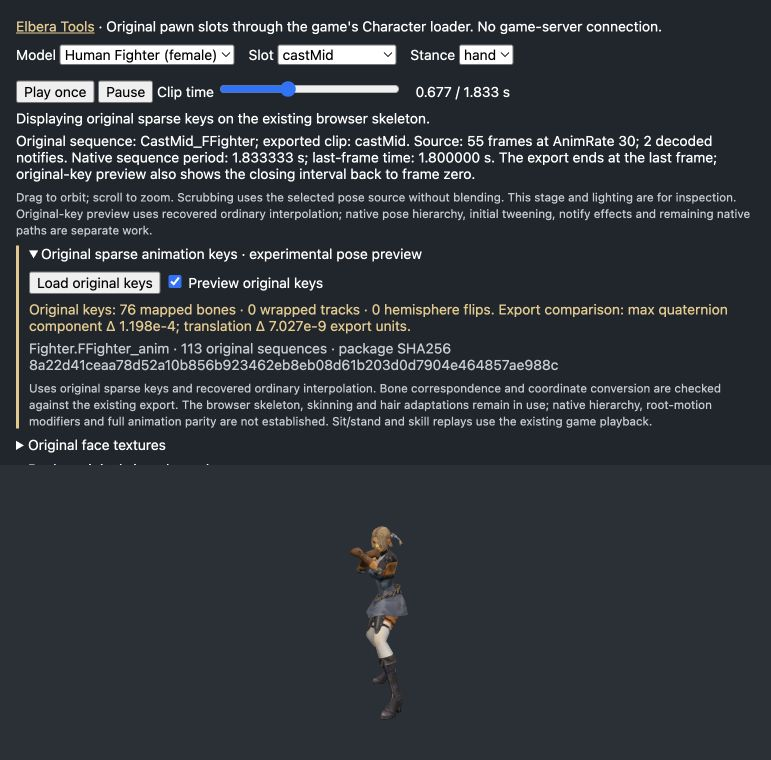

# Elbera Tools: ordinary original animation tracks

The browser can now sample **original sparse local tracks**, without using PSA
resampling or glTF frame times. This is an inspection primitive, not a claim that
complete native animation, mesh bone association or live hair placement is solved.

## Reproduce

Portable runtime cases, without client inputs:

```sh
node --test editor/world/test/nativetrack.test.mjs
```

Original instruction and browser differential check, requiring the owner's
pinned Engine.dll, Python with Capstone and Node:

```sh
python3 tools/ui/check_track_native.py --check
```

The source check pins owned Engine SHA-256
`07b24af4ab55e4230d0a7949df5b07565319e62a1b20f38fefb16ebe54821ad0`.
It verifies 15 instruction anchors and six complete ranges. It interprets the
actual retained search, alpha, hemisphere and translation instructions on
synthetic inputs: **382 + 203 + 102 cases**, respectively. Another **59 cases**
compare the actual browser module with those instruction results and the
separate bounded quaternion model. Selection and positions match exactly;
quaternion comparison permits `2e-6` component error for cross-language math.
No native code is executed and no original poses are emitted by this check.

The ordinary sampler is `0x106bb6a0..0x106bbbb7`, SHA-256
`3dd5a42e561e9eaa2a2e90eab0066206820ae25445e967e182bce404d17df784`.
These retained sampling operations need no supplemental binary. The called
quaternion helper has its own [original and supplemental evidence](native-quaternion-evidence.md).

## Supported API

[`sampleOriginalTrack(track, duration, frame)`](../editor/world/js/nativetrack.js)
returns `quaternion`, `position`, `first`, `second`, `alpha`, `wrapped` and
`hemisphereFlipped`. Values remain in original source-local coordinates.
Invalid or unsupported records throw; the function does not invent a reference
pose, normalize missing fields, choose a mesh bone or alter its inputs.

The bounded input shape is explicit `flags: 0`, nonempty time keys starting at
zero and strictly increasing, one quaternion per time, and either one position
or one position per time. Components and derived values must remain finite
Float32. Duration is positive, with last key no later than duration; normalized
frame is in `[0,1]`. Negative-zero times/frame and unsupported shapes are rejected.
Strict time order is the measured source domain, not a claim that native code
validates malformed tracks: its retained search can be tested separately with
repeated times.

## Native sampling rules

| Step | Retained evidence | Implemented rule |
| --- | --- | --- |
| Source time | `0x106da48a..0x106da4cc`; independent `PoseFrame` at `0x106c7489..0x106c74c7` | Caller clamps normalized frame to `[0,1]`, stores Float32, then stores `duration * frame` as Float32. The browser API requires the bounded normalized input. |
| Track selection | `0x106bb6a0..0x106bb76c` | Last key at or before source time; linear search through 30 keys, at most 32 stepping binary-search iterations above 30. Successor wraps to zero after the final key. |
| Alpha | `0x106bb799..0x106bb816` | One key means zero. Ordinary denominator is `abs(f32(nextTime-currentTime))`; closing denominator is `f32(duration-currentTime)`. If denominator is greater than original double `0.00009999999747378752`, use `f32((time-currentTime)/denominator)`; otherwise use one. No alpha clamp is added. |
| Exact key | `0x106bb82b..0x106bb83c`, `0x106bbb4b..0x106bbb6a` | Zero alpha copies the stored quaternion, without normalization. |
| Hemisphere | `0x106bb88f..0x106bb8a4` → `0x106b56d0..0x106b5804` | Ordinary mode adjusts only the closing pair, and only while blending. It may negate the successor; adjacent stored pairs are unchanged. |
| Rotation | `0x106bb94c..0x106bb968` | Current, adjusted successor and alpha feed the separately documented ordinary quaternion helper. This is not the initial-tween helper. |
| Translation | `0x106bb96b..0x106bbb91` | A one-position track stays constant. Otherwise each component is `f32(current + f32(f32(next-current)*alpha))`, preserving all three stores. |

Native key search compares unsigned Float32 **words**, not floating-point
comparisons. Numeric ordering is equivalent only for the admitted finite,
nonnegative domain. The implementation preserves the original 30-key split and
32-iteration bound; it does not generalize this to NaN or signed time inputs.

The hemisphere helper computes Float32 `candidate-reference` and
`candidate+reference` components, rounds each square, adds them in
`((y²+x²)+z²)+w²` order and rounds the final norms. It negates candidate only when
`norm(plus) < norm(minus)`, strictly. Ties are unchanged. Replacing this with
`dot < 0` can lose the original rounding rule; eagerly normalizing endpoints can
also change the original exact-key/copy branches.

## Original data path and measurement

The reusable decoder is
[`original_animation(..., include_tracks=True)`](../tools/anim/build_pawnanim.py).
It retains original reference bones, movement duration/flags/indices, raw
quaternion/position/time arrays and separate root track. It checks every saved
movement endpoint, the outer movement endpoint and complete MeshAnimation
export, including sequence trailers. Existing timing-only callers retain their
`original_sequences` API. No PSA/glTF is used as the source oracle.

[`export_source_tracks.py`](../tools/anim/export_source_tracks.py) writes ignored
private inspection inputs under `assets/gamedata/animation-tracks/`. Original
player packages are Fighter, Magic, Elf, DarkElf, Orc, Shaman and Dwarf;
`build_pawnanim.PAWNS` joins each model to its exact `<prefix>_anim` export.
Package/export/record hashes accompany the retained inputs.

A fresh private audit of all 14 source exports measured 1,367 sequences and
110,512 ordinary tracks: 51,304 constant rotation/position tracks, 44,936 varying
rotations with constant position, and 14,272 tracks varying both. Every quaternion
count equals its time count; all flags are zero. All time arrays start at zero,
have no duplicates and end before movement duration. There are zero negative-dot
adjacent quaternion pairs, but **121 negative-dot closing pairs**. No varying
track ends before source frame `N-1`; this does not prove dense exported samples
preserve native subframe quaternion interpolation. These counts describe these
supplied inputs, not a universal package-format guarantee.

## Browser pose preview

The existing [Elbera Tools pawn inspector](../editor/world/test/pawn-original.html)
can now render original sparse keys on its loaded browser character. Generate
private inputs, start the usual local asset server, open
`/test/pawn-original.html?model=human_fighter_f&slot=castMid&stance=hand`, expand
**Original sparse animation keys**, and choose **Load original keys**:

```sh
python3 tools/anim/export_source_tracks.py human_fighter_f --write
# Or decode all 14 models; --check independently compares existing outputs.
python3 tools/anim/export_source_tracks.py --write
python3 tools/anim/export_source_tracks.py --check
```

Toggle **Preview original keys** to compare the original sampler with the
existing exported animation. Play, pause and scrub share the same controls.
Original preview includes the full sequence period and its closing interval;
the exported comparison clamps at its last stored frame. The displayed deltas
measure local quaternion components (accounting for q/-q) and local translation
in export units. They are not angular error, world-space displacement or a
native-client visual score. Cast and sit/stand replays retain existing game
playback; starting either leaves the experimental preview.



Actual local preview, at 0.677 seconds. This is the existing browser character
with original-key sampling enabled, not a capture from the official client.

The adapter requires unique case-insensitive bone names **under the same parent
identity**, using the loader's preserved source names. It never matches by a
name alone or substitutes an index. Each sequence must have ordinary flags,
start bone zero, a complete track array and an explicit identity BoneIndices
array. This last requirement bounds the preview; it does not establish the
native linkup table. Missing exported comparison clips remain unavailable.

The supplied outputs fully match this structural gate for **13 of 14** models.
Male Human Fighter is deliberately rejected: its animation calls one right-hand
finger `Bip01_L_Finger01`, while the merged export names it `Bip01_R_Finger01`.
A separate original-part reconstruction explains that export mapping, including
two swapped index pairs, but explicit reusable binding metadata has not yet been
added. The inspector does not hide this with a name alias. Fifteen original
sequences also have empty serialized maps and remain outside this preview gate.

The raw-source-to-existing-export conversion is position
`f32(0.01 * [x,z,y])` and quaternion `[x,z,y,w]`, with root XYZ negated. This
combines the existing PSA mirror with the measured glTF conversion; applying
only the latter directly to raw source keys would reverse Y/W incorrectly.
Across the uniquely matched bone records, **94,831 translation and 94,831
quaternion first keys** matched the existing exports at their Float32 stores. This checks
the adapter, not native actor placement or all intermediate poses.

The preview still uses the current browser hierarchy, inverse bind matrices,
skinning, grounding and hair adaptations. Original GetFrame linkup, live parent
composition, channel mixing, root-motion modifiers, initial tweening and dynamic
hair must be integrated separately before adopting it as game playback. Original
keys and captured local receipts stay ignored and are not part of the public
repository or the standalone Core 0.1.0 archive.

## Boundaries before live adoption

The ordinary mode-zero caller explicitly passes an animation linkup table entry
as the track index (`0x106da5b0..0x106da60d`), skipping negative entries. That table
is separate from serialized movement `BoneIndices`; 15 measured source sequence
maps are empty. This sampler does not infer a mesh-to-animation association,
substitute an identity map or attach hair to a guessed head bone.

The raw animation reference skeleton can be inspected independently. Applying
it to a rendered character still needs the source association, parent composition,
channel masks/mixing, initial tween, root-motion behavior and mesh transforms.
The current-pose comparison uses `ApplyPivotWithoutScale`; reference-cache
`ApplyPivot` results must not be substituted for that different operation.
Ordinary and dynamic hair paths remain separate, as described in the
[attachment evidence](native-hair-attachment-evidence.md).

JavaScript/Python Float64 intermediates approximate native x87. Visible Float32
stores are preserved, but native precision control, exceptions and original CRT
trigonometry are not reproduced bit-for-bit. The browser helper is deliberately
bounded and must not be advertised as complete native skeletal playback.
