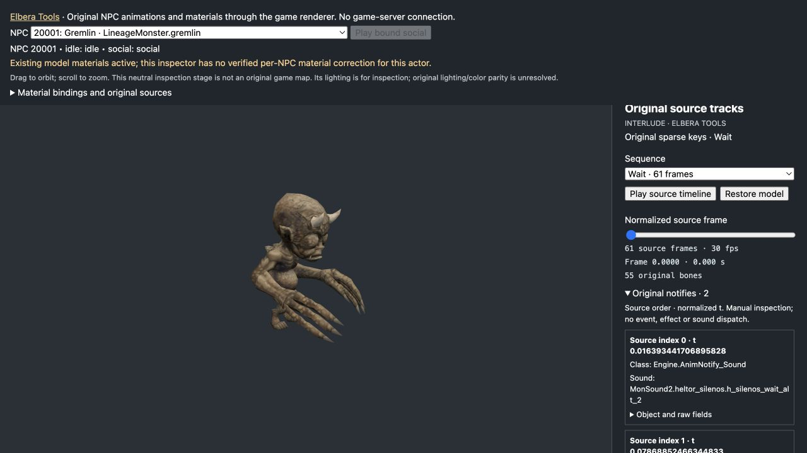

# Elbera Tools: original NPC animation transport and inspection

Gremlin 20001 and fox 20091 now have private bundles containing every sequence
in their original bound animation objects. The normal NPC entity loader verifies
and loads these inputs; the manual inspector can display the sparse source poses
through that entity's existing model. **Automatic live native NPC playback is
off.** Loading source data does not establish a live actor's complete native
state, modifiers, animation transitions or event schedule.

## Inputs and reproducible generation

Run from the repository root with the owned Interlude files under
`assets/interlude/`, the existing DAT/INT decryption helper, and the current
converted monster manifest/models under `editor/characters/monsters/`:

```sh
# Fresh original decode and correspondence checks, without writing.
python3 tools/anim/export_source_tracks.py --npc 20001 20091 --runtime
# Generate the private selected set, then independently re-decode and compare.
python3 tools/anim/export_source_tracks.py --npc 20001 20091 --runtime --write
python3 tools/anim/export_source_tracks.py --npc 20001 20091 --runtime --check
# Also retain the original stored GPU influence lanes, without rebuilding glTF.
python3 tools/anim/export_source_tracks.py --npc 20001 20091 --runtime --npc-skin --write
python3 tools/anim/export_source_tracks.py --npc 20001 20091 --runtime --npc-skin --check
```

The collector reuses [qualified selector recovery](npc-animation-variants.md):
original `npcgrp.dat`, qualified UClass inheritance and localized `.int` fields
identify each NPC's class and mesh. The mesh's serialized `Animation` reference
identifies the animation export, including package and groups. No same-name
animation guess or historical glTF alias supplies that identity. Original mesh
bones and all original sparse animation keys are read afresh; the two package
hashes and two export hashes remain separate, including for cross-package links.

This checkpoint uses these original input fingerprints; the private index
records all contributing class packages and localization files as well:

| Original input | SHA-256 |
| --- | --- |
| `animations/LineageMonsters.ukx` | `157715304bfb1f289ce6bf202e5651f3809f57d5b061239db0c6a2a817c9a9c9` |
| `system/LineageMonster.u` | `f06ac53f7df24bd13d6e7a0d25d9e3ca4e4502af2437518e49d96a053987d7b6` |
| `system/Engine.u` | `9b04ff5cb4258e84dfa8efbdd85d9121f3bdcb5822a9a21ca69d200d05a69761` |
| `system/npcgrp.dat` | `f551a0f9a0d6765bd783d8f55b1847ba2d5e17acb9a50ae4268c11e1f13d3e8c` |

The bounded mesh reader supports file version 123, licensee 28/30 and LodMesh
version 5. Unsupported records fail rather than borrowing another mesh. The
decoded-name linkup has a casefold-unique source name-table gate; same-package
tokens are also compared directly. This preserves the [native first-name
matching rule](native-animation-linkup-evidence.md), separate from the unique
name/parent paths used to associate the existing browser skin joints.

Outputs are ignored private data:

- `assets/gamedata/npc-animation-runtime.json`
- `assets/gamedata/animation-tracks/runtime/npc_<32 hex digits>.l2anim`

The token is derived from the qualified mesh name; it does not replace the full
mesh/animation references or source fingerprints. The index contains the
explicit requested NPC set, not an incremental merge. All requested inputs
validate before writes begin. Each bundle is replaced atomically and the index
is adopted last; an interrupted multi-file update fails hash admission rather
than passing as the old set. `--check` compares fresh bytes and writes nothing.

## Source coverage and geometry boundary

| NPC | Original mesh → animation | Mesh/animation bones | Base bundle / with GPU inputs |
| --- | --- | --- | --- |
| Gremlin 20001 | `LineageMonsters.gremlin_m00` → `LineageMonsters.gremlin_anim` | 55 / 55, all linked | 433,888 / 496,216 bytes |
| Fox 20091 | `LineageMonsters.fox_m00` → `LineageMonsters.Fox_anim` | 40 / 40, all linked | 357,336 / 379,084 bytes |

Both bundles retain eight sequences, including the one-frame `deathwait` and
the `atkwait` absent from their legacy converted clips. All listed source rates
are 30; counts are recovered data, not browser playback deadlines:

| Original sequence | Gremlin frames | Fox frames |
| --- | --- | --- |
| `Wait` | 61 | 61 |
| `Walk` | 23 | 31 |
| `run` | 17 | 21 |
| `atkwait` | 41 | 31 |
| `atk01` | 55 | 55 |
| `death` | 64 | 43 |
| `deathwait` | 1 | 1 |
| `SpWait01` | 101 | 81 |

The current source exporter also decodes all 17 notify records per model through
the existing player notify reader. It follows qualified original class ancestry,
fully consumes each referenced object export and preserves serialized order,
null references and original Float32 times. Object fingerprints remain distinct
from the sequence fingerprint. `Engine.u` supplies the class hierarchy and the
explicit `AnimNotify_Sound` defaults; its hash must match selector recovery before
collection proceeds. The catalog retains this hash and the default-stream evidence.

These 34 events are `Engine.AnimNotify_Sound` or `Engine.AnimNotify_AttackShot`.
The Gremlin attack sequence's AttackShot time is `0.3618181645870209`; that is a
stored normalized event time, not a server damage deadline. Wait sound records
have `Random=30`, and attack-wait sound records have `Random=50`. Their fields
are preserved without treating them as always-play sounds. The
[native sound evidence](native-cast-sound-evidence.md#separate-animation-sound-notifies)
distinguishes original random gating, volume conversion and source data from
audio-driver behavior. Event extraction alone does not admit live dispatch.

The published NPC Source 0.1.0 archive predates this object-metadata addition;
its raw event references remain unchanged in that immutable release. These
instructions describe the current repository exporter.

For these two current models, the exporter independently checks original LOD0
triangle positions, UVs and winding against actual glTF/buffer contents:
Gremlin has 1,324 source vertices and 1,762 triangles; fox has 422 and 584.
Every source bone maps to a unique browser joint by its name/parent path.
The manifest alias is only a file locator. Exact glTF/buffer hashes, lengths,
mesh/skin indexes and joint identities accompany that correspondence.

The original files contain two influence representations: lazy influence arrays
and stored GPU vertex records. The old converter uses the lazy arrays, packs
weights into bytes, merges repeated bones and normalizes them; the glTF assembler
normalizes again. Fresh conversion reproduces every current glTF vertex. The
previous 582/1,324 Gremlin and 215/422 fox discrepancy counts compare those glTF
records against the **stored GPU stream**, not against a single universal native
weight representation. There are no unexplained bone-set changes or dropped
influences in these two models.

`--npc-skin` carries the stored GPU stream's four original Float32 lanes in the
existing source bundle. It requires the original GPU stream flag, a supported
section palette and exact per-section vertex correspondence. Duplicate geometry
keys with different ordered influences fail closed. Repeated bones, lane order
and weights survive unchanged; source sentinel lanes remain explicit. No source
or converted model is overwritten. The source inputs are bound to the original
LOD hash and the exact verified glTF/buffers.

The runtime replaces actor-owned skin attributes after GLTFLoader parses the
model: that loader otherwise renormalizes even Float32 weights and changes zero
rows. Source bone ordinals map through the verified node identities into actual
skin-joint order. A zero-weight sentinel uses a valid, noncontributing browser
joint slot; this is an explicit transport adaptation. No inverse-bind matrix is
changed. **Exact GPU input preservation does not certify native deformation:**
original shader arithmetic, the separate CPU skinning path, inverse binds,
actor placement, materials and lighting remain open. This is two source models,
not a complete NPC-roster audit. The [native GPU input evidence](native-npc-skin-evidence.md) records the conditional original consumer and its limits.

## Transport and browser ownership

NPC bundles reuse the [ELBA transport](original-animation-runtime.md#authored-transport-and-ownership):
the 16-byte header, padded JSON metadata and exact little-endian Float32 q/p/time
arrays. Keys are neither resampled nor dropped. The authored format names are
`elbera-original-animation-runtime-v1`,
`elbera-original-npc-skeleton-v1` and
`elbera-original-npc-animation-runtime-index-v1`; these are tool contracts, not
original client file formats or game rules. Existing player bundle bytes are
unchanged by the NPC extension.

With `--npc-skin`, optional `skeleton.sourceSkin` metadata uses
`elbera-original-npc-skin-inputs-v1` inside the same container. Its ordered
influence records describe the stored `soft52` GPU stream, not the legacy lazy
arrays. The index retains an explicit full-skinning limit and separately names
the admitted input representation. Old bundles without this field retain their
converted skin attributes.

The real entity path loads `/gamedata/npc-animation-runtime.json` and verifies
the selected class, qualified mesh/animation, bundle, glTF and buffers before
parsing those same verified bytes. Immutable inputs may be shared; each actor
gets a separate parsed scene and pose state. Rejected fetches are evicted for
retry. Removed entities and replaced object IDs retire pending loads. An absent
index or an NPC outside its selected set retains existing playback; a mismatched
included entry cannot silently use different source bytes. Existing converted
animation remains the live playback backend.

## Manual browser inspection



With the matching private assets prepared, start the existing local asset server:

```sh
python3 editor/world/server.py
```

Open [Gremlin](http://127.0.0.1:8083/test/npc-original.html?npc=20001) or
[fox](http://127.0.0.1:8083/test/npc-original.html?npc=20091). The page uses the
actual entity renderer and requires the existing private NPC visual/name/material
catalogs. It does not connect to the game server or change an account.

Under **Original source tracks**, select a sequence and move the normalized-frame
slider, or use the inspection timeline. The displayed `frames/rate` interval and
its wrapping are manual inspection controls, not a recovered native playback
clock. One-frame corpse sequences can be inspected directly. The source overlay
pauses entity mixer updates; restoring the model resumes converted playback.
Switching sequence/model, an invalid input or disposal restores the captured
local matrices and transforms instead of leaving an old source pose applied.

The page shows qualified identities, the animation-export hash and explicit
weight/placement limits. **Original notifies** lists the selected sequence's
events in their stored order, including exact normalized times, classes, object
identities and raw sound fields with their source owners. Missing metadata is
distinct from an original empty event array. Source inspection does not execute native stance
selection, transitions, attack choice, notifies, effects or sounds. Recovered
initial-wait [consumer evidence](native-npc-animation-evidence.md) is separate
from a complete packet/event admission
gate; no default tail values or assumed summon classification enable it here.

## Portable checks and release boundary

These fixtures need no original game files, generated catalog or server:

```sh
python3 -S -m unittest discover -s tools/anim -p test_export_source_tracks.py
python3 -S -m unittest discover -s tools/anim -p test_build_npc_variants.py
node --test editor/world/test/npcsourceanim.test.mjs editor/world/test/npc-source-skin.test.mjs editor/world/test/npc-source-inspection.test.mjs editor/world/test/npc-entity-lifecycle.test.mjs editor/world/test/npcanimations.test.mjs
```

They cover strict source joins, Float32 transport, original notify-object decoding
and provenance, malformed data, verified-byte
loading, independent actors, pending-load retirement, reversible source inspection
and existing clip supplements. Fresh `--check` above is a separate original-input
check. Neither suite is a full native visual or gameplay certification.

Code and synthetic fixtures are part of the repository's Elbera Tools collection.
Original packages, generated bundles/models/catalogs and detailed local receipts
remain private under the [public-release boundary](public-release-boundary.md).
The separately released **Elbera Tools Core 0.1.0** does not include this NPC
pipeline or browser inspector; see its [allowlisted scope](../tools/release/CORE-README.md).
